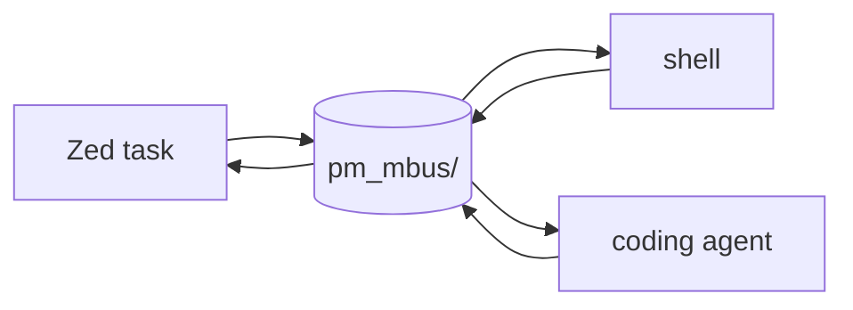

# DBJ Poor Man's Message Bus

A shared folder, `pm_mbus/`, at the repo root. Anyone working on this repo —
human, editor, agent — writes to it and reads from it. No daemon, no
protocol, no dependency. Files are the messages.

It is private to this project: it lives under the repo root, and its
contents are never committed.

## Shape

```
pm_mbus/
  build.log     # build output, appended by whoever built
  notes.md      # free text between participants
  state.json    # current status, single small object
```

The filename names the **topic**, not the writer. `build.log` is not
Zed's file and not Claude's file — it is the build topic.



## Rules

1. **Append, never rewrite** the logs. Two writers at once then cost you
   interleaving, not lost text.
2. **One topic per file.** A reader tails one thing.
3. **`state.json` is the exception** — it is rewritten whole, by one
   writer at a time, and stays small.
4. **Nothing in `pm_mbus/` is a source of truth.** It is chatter. If it
   matters, it belongs in the repo proper.

## Writing to it

From a shell:

```sh
your-build-cmd 2>&1 | tee -a pm_mbus/build.log
```

From a Zed task, `.zed/tasks.json`:

```jsonc
{
  "label": "build → pm_mbus",
  "command": "./build.sh 2>&1 | tee -a pm_mbus/build.log"
}
```

## Reading from it

Tail it, open it, or point an agent at it. There is nothing else to know.

## Git

`pm_mbus/` is tracked only as an empty folder, via `.gitkeep`. Everything
else in it is ignored, so a clone has the bus but not yesterday's noise.

---

## Vocabulary

- **Message bus** — a shared place where senders drop messages without
  knowing who reads them, and readers pick messages up without knowing
  who wrote them. Here the "bus" is a folder and the messages are files.
- **Topic** — the subject a message is about. Real buses route by topic;
  here the topic is simply the filename.
- **Append-only** — a file that is only ever added to at the end, never
  edited or truncated. This is what makes concurrent writers safe enough
  without locking.
- **Tail** — to read the end of a growing file, usually as it grows
  (`tail -f`).
