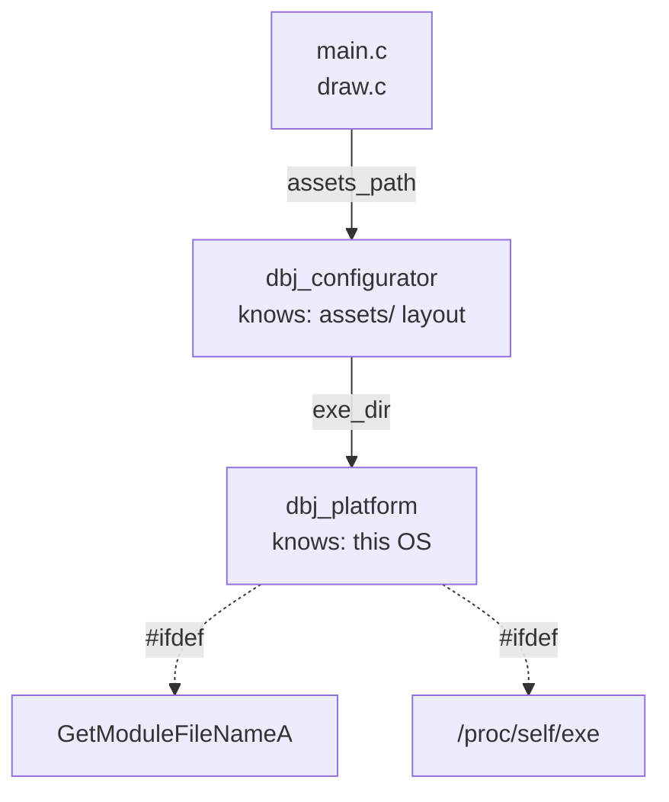

# dbj_the_game — milestone two chamber

Judgement on milestone two, filled in as the work lands. Nothing is built yet,
so the sections below are empty on purpose — an empty verdict is honest, an
invented one is not.

Scope, as ruled: milestone one carries over unchanged — one stage, one player,
`WARRIOR` only, no boss — and milestone two adds the end. The player dies, the
game stops, and a dialogue offers "Restart" or "Exit".

## Discussion

Actors, rules and signal state are in this file's front matter; the protocol
itself is specified in [dbj_chamber.md](dbj_chamber.md).

---

<details id="DBJ_notes" markdown="1">
<summary><b>DBJ</b></summary>

[open] Until milestone_3 all development will have to happen in branches spawned from MIlestone_2 branch

[open] I want the  [assets issue ](#1-assets-must-live-next-to-the-exe) implemented first.  The main objection: issue 1 names one path, but there are six — main.c:42 plus five LoadTexture calls in draw.c:20-24, and those five fail silently. And its stated remedy (copy assets next to the exe) doesn't achieve its stated goal, since the paths stay relative to the working directory either way. So I want `dbj_configurator` to encapsulate the solution in a single `struct` and then called from where it is needed. and do that in `dbj_configurator.h`/`dbj_configurator.c` ..you knpw the drill: factory method to make it, then function pointers to functions implementing it in `dbj_configurator.c`

</details>

---

<details id="ASH_notes" markdown="1">
<summary><b>ASH</b></summary>


</details>

---

<details id="ZED_notes" markdown="1">
<summary><b>ZED</b></summary>

### Design — issue 1, as ruled

Two structs, two file pairs, both in `dbj_the_game/`. `dbj_platform` knows the
OS; `dbj_configurator` knows the layout and holds a platform. Nothing above
`draw.c` is involved, so the windowless test binary can link either.



`dbj_platform.h` — OS knowledge only, no raylib:

```c
typedef struct dbj_platform dbj_platform;
struct dbj_platform {
	// directory holding the running exe, no trailing separator.
	// false on failure; out untouched.
	bool (*exe_dir)(char *out, size_t cap);
	char sep;
};
dbj_platform dbj_platform_make(void);
```

`dbj_configurator.h` — layout knowledge, extended later for logically similar
duties. Returns by value, so nothing owns a buffer and nothing outlives one:

```c
DEFINE_DBJSTR_TYPE(dbj_str_512, 512);
DBJ_MAKERESULT(dbj_str_512);          // -> dbj_str_512Result

typedef struct dbj_configurator dbj_configurator;
struct dbj_configurator {
	// "castle.txt" -> OK("<exe_dir>/assets/castle.txt"), or ERR
	dbj_str_512Result (*assets_path)(const dbj_configurator *cfg,
	                                 const char *leaf);
	dbj_platform plat;
	dbj_str_512 root;   // "<exe_dir>/assets", resolved once at make time
};
dbj_configurator dbj_configurator_make(void);
```

Rulings folded in, and what each costs:

- **Assets ship beside the exe.** The Makefile gains a copy step: `assets/` into
  `$(BUILD_DIR)/assets/`. Consequence to state plainly — `make run` stops being
  special, and running `builds\dbj_the_game.exe` from anywhere works, which was
  the point.
- **Fail hard, with an explanation.** No silent fallback to the working
  directory. This also fixes the five silent texture loads: `draw_load_art`
  resolves through the configurator and reports the resolved path it tried, so
  a missing texture is a message rather than an invisible sprite. The ERR arm
  already carries `location` and `message`, so the explanation has somewhere to
  live without inventing one.
- **Both file pairs in `dbj_the_game/`.** Not `../toplevel/` — everything there
  is header-only, and these need translation units.

Two mechanical consequences of reusing the toplevel headers, recorded so the
next reader does not rediscover them:

- `dbj_str_512_create` takes `const unsigned char src[static 512]` — a promise
  of 512 readable bytes, which a string literal does not keep (`-Wstringop-overread`,
  fatal under `-Werror`). Paths are therefore built with `snprintf` into a real
  `unsigned char buf[512]` and that array is what `_create` receives. Same trap
  [dbj_result.h](../../toplevel/dbj_result.h) already documents at its line 46.
- `snprintf`'s return value is the length it *wanted*; `>= 512` means truncation,
  which becomes ERR naming the leaf that did not fit rather than a silently
  shortened path.
- Storage is `unsigned char`, raylib and `fopen` want `const char *`, so each of
  the six call sites casts. Accepted as temporary — revisited once it compiles.

[open] Issue 1 is stated as one path, but there are six. `main.c:42` loads the
map; `draw.c:20-24` loads five textures. The map failure is loud (`return 1`),
the texture failures are silent — raylib logs a warning and hands back a zeroed
`Texture2D`, so a wrong working directory gives you a running game drawing
nothing. Whatever fixes this must fix all six, or the fix looks like it worked.

[open] Issue 1's title says "next to the exe" but its body says "copy the assets
folder relative to where exe was built". Those are two different remedies. Copying
assets into `$(BUILD_DIR)` still leaves the paths relative to the *working
directory*, so `builds\dbj_the_game.exe` from the repo root still fails — you've
moved the files and changed nothing. Making it work from anywhere needs the
program to resolve paths against its own image location, not the build to
duplicate files. Copying only helps if you also always `cd` into `builds` first,
which is the same constraint you have now with a second copy of the assets.

[open] `make run` already works and the Makefile says why (line 73). So the real
question in issue 1 is not "is it broken" but "should the exe be runnable from
anywhere". That is a ruling, not a bug fix, and it is DBJ's.

[fix] Front matter names `spec: dbj_chamber.md` and the Discussion section links
to it. No such file exists in `docs/`. Either it is unwritten or it is elsewhere.

[open] Issue 6 "Winability" restates the milestone contradiction but sits in the
issue list as if it were implementable work. It is not — it is the open question
that decides whether issues 2-5 are the whole milestone or half of it. The empty
ruling table that used to carry it is gone.

</details>

---

> Contents

## The list of issues to be implemented in milestone_2

### 1. Assets must live next to the exe

main.c:42 opens assets/castle.txt relative to wherever you started it.
dbj_the_game/ is the only directory where that path resolves. So build has to
copy the assets folder relative to where exe was built.

### 2. Death freezes the simulation

**`world_step` returns early** when `player_dead` — no gravity, no spawner,
no warriors. The last frame stays on screen behind the dialogue.

### 3. The loop switches modes on death

**`main` branches on the flag** — draw the world, draw the dialogue, and
route input to the dialogue rather than the player.

### 4. Dialogues get their own translation unit

**The dialogue**, two buttons, in its own `dialogues.h` / `dialogues.c` —
ruled: dialogues do not go in `draw.c`, and this is where every later one
lands too. It needs raylib, so it sits at the same level as `draw.c`, never
below it. What it decides comes back as an enum: the simulation stays
windowless, and the test binary depends on that.

### 5. Restart or Exit on Death

**Restart and Exit.** Exit leaves the loop; Restart reloads the map into a
fresh `world w = {0}`.

Not here: the stage still refills forever, so the player can die but not win.

### 6. Winability

[design.md](design.md#milestone-two) says milestone two must be
*winnable*. A death dialogue ends the game; it does not let the player finish
it. One ruling, two readings.


---

(c) 2026 by dbj@dbj.org | MIT license
