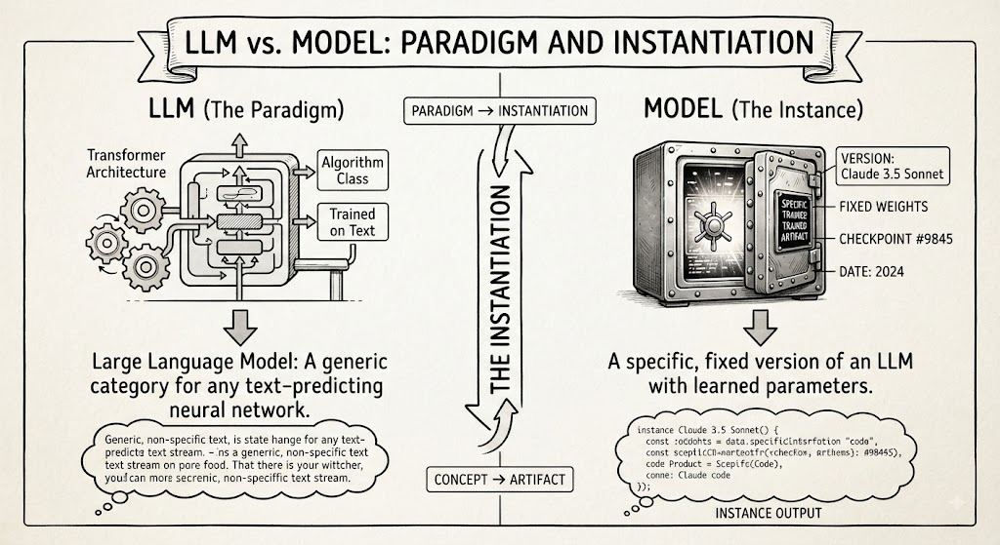
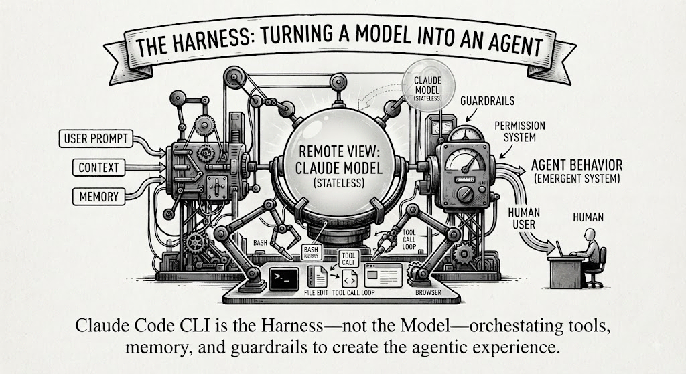

# Key AI Vocabulary 

(Otherwise deliberately confused by marketing)

## What is the difference Model vs LLM ?



- **LLM** — the algorithm/architecture class: a transformer trained on text to predict tokens. Generic "large language model" describes a [category](#category), not an instance.
- **Model** — a specific trained artifact: fixed weights, a version, a checkpoint. Example: Claude Sonnet 5 *is* an LLM, but "the LLM" and "this model" aren't interchangeable
 
> The model is the instantiation, the LLM is the paradigm.


## The Harness




That is Correct terminology-wise. "Harness" is the term used in agentic-AI circles for the scaffolding around a model — the CLI, tool-calling loop, permission system, context management — using that, turns a raw LLM into an agent that can act. Claude Code is Anthropic's harness for Claude: it wraps the model with file/bash/edit tools, a loop, and guardrails.

> Distinction worth keeping: the harness ≠ the model. 

Claude Code, Cowork, are what differs; the harness around it — the tools it's given (file editing, bash, browser, etc.), how much memory/context it keeps, and what actions it's allowed to take, on your desktop.

Practical distinction that matters for AI harness point: the **model** is stateless. Everything humans experience as "agent behavior" (memory, tool use, multi-turn state) comes from the harness orchestrating repeated calls to that model, not from the model itself. So the stack is:

```
LLM (paradigm) 
→ Model (weights/checkpoint) 
→ Harness (orchestration/tools) 
→ Agent (emergent behavior)
→ Human user
```

In [BPT](https://method.dbj.org/bpt) operating terms, AI model is "technology," harness is closer to "product,". What the user experiences as an agent is the assembled system.

# Vocabulary

### Theoria mundi de architectorum

Rough translation: "theory of the world, of/concerning the architects" — i.e., a *world-theory belonging to architects* or "the architects' worldview/theory of the world."


 Not a standard classical Latin. 
 A stricter classical phrasing would be:

 - `Theoria mundi architectorum` : "the architects' theory of the world", or

 - `Theoria de mundo architectorum` : "a theory about the architects' world" 

 As a motto, the irregularity reads fine as a title/aphorism.

### Category

See (for example) [DBJ Taxonomy](https://method.dbj.org/taxonomy_core.html) for an immediate usage in the context of IT supported commercial organization.

---

(c) 2026 by dbj@dbj.org | MIT License