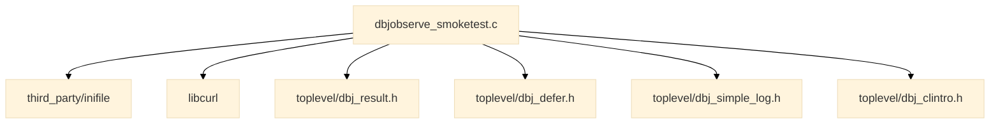
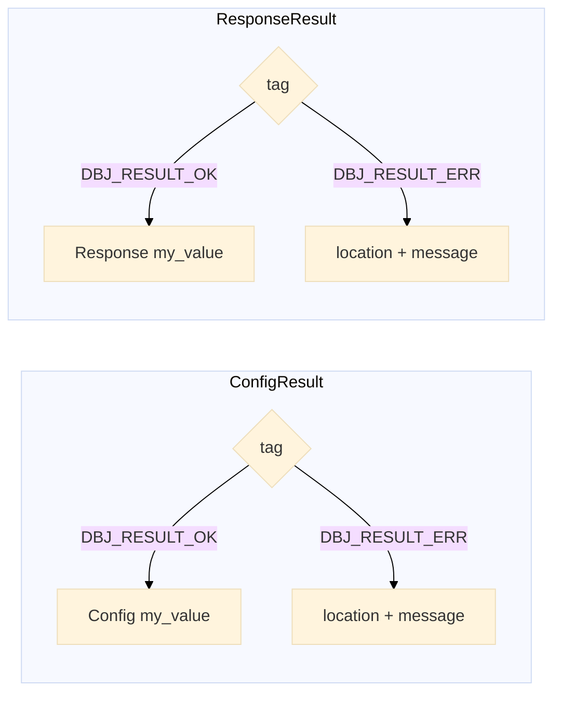
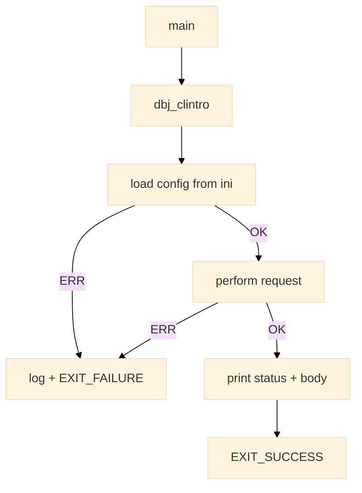

<h1> dbjobserve -- design notes </h1>

> We are enjoying the metapresence of [DBJ Taxonomies](https://method.dbj.org/taxonomy_core.html). Thus we can communicate where are we in the information space with this doc.

```
Category:       Implementation
Capability:     Development
```

**Table of Contents**
- [What this is](#what-this-is)
- [Module relationships](#module-relationships)
- [Configuration](#configuration)
- [Result shape](#result-shape)
- [Request flow](#request-flow)
- [Resource release](#resource-release)
- [Portability](#portability)

# What this is

A single-file CLI that queries the JobServe job-search API over HTTPS
and prints the response. It exists to exercise libcurl inside this
repo's conventions, not to be a JobServe client library.

The API token is a secret. It is never in the source, never on the
command line (where it would land in shell history and in `ps`
output) -- it is read from `dbjobserve.ini`, which `.gitignore`
already excludes repo-wide via `*.ini`.

# Module relationships



`toplevel/` knows nothing of this folder -- the dependency is one way
only, as it is for every other POC folder in this repo.

# Configuration

`dbjobserve.ini` is read from the current working directory. There is
no command-line path and no default token: a missing file, or a
missing token key, is a hard startup failure.

```ini
[jobserve]
token    = <your-api-token>
keywords = c programmer
location = London
```

`keywords` and `location` are in the ini rather than on the command
line so that a run is fully reproducible from one file. Only `token`
is mandatory; the other two have built-in defaults.

# Result shape

`DBJ_MAKERESULT` from `toplevel/dbj_result.h` generates the tagged
union. Two payload types are needed, so two instantiations:



Every `switch` over `.tag` is exhaustive with no `default`, so
`-Wswitch -Werror` catches an unhandled variant at compile time.

`Response` carries the HTTP status and the heap-allocated body. The
body's owner is the caller that receives the OK variant -- the accumulating
buffer is a separate, function-local type that never escapes.

# Request flow



Both fallible steps return a Result. No step reports failure through a
global, an `errno` read at a distance, or a sentinel return.

# Resource release

`toplevel/dbj_defer.h` (Gustedt's `defer`, built on `[[gnu::cleanup]]`)
releases every curl resource, so the many error exits from the request
function need no unwinding ladder and no `goto`.

`defer` runs a *block* at scope exit, so it is used directly rather
than through per-type cleanup functions:

```c
CURL *curl = curl_easy_init();
defer { curl_easy_cleanup(curl); }
```

This replaces the earlier draft's hand-written `[[gnu::cleanup]]`
pointer-cleanup helpers (`curl_easy_cleanup_p` and friends) -- the repo
has one defer mechanism and this file uses it.

Note the escaping response body is deliberately *not* deferred: it is
returned to the caller, who owns it from that point.

# Portability

Linux is a first-class target; this is not a Windows program.

| | Windows (MinGW) | Linux |
|---|---|---|
| libcurl | vendored static `third_party/libcurl/lib/libcurl.a` | system libcurl, via `pkg-config --static` |
| link | fully static, Windows system libs | as `pkg-config` reports |

Only the Windows side is vendored, because a MinGW `.a` cannot link on
Linux -- a vendored Linux prebuilt would be a second, separate binary
blob to keep provenance for. The Makefile branches on `$(OS)`; the C
source has no `#ifdef _WIN32` in it at all.
