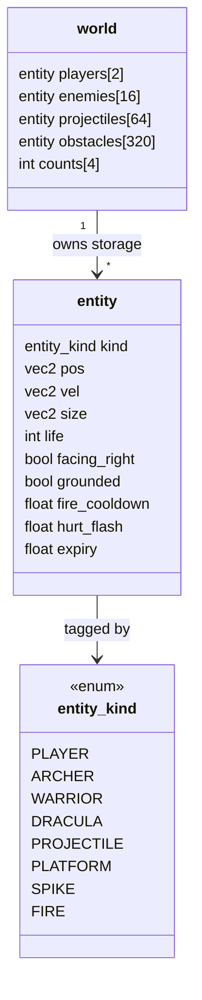
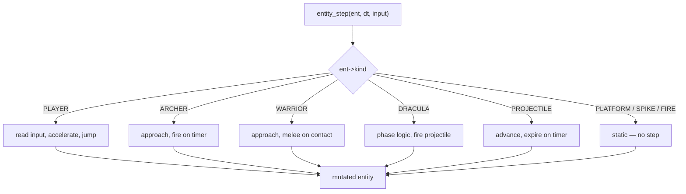
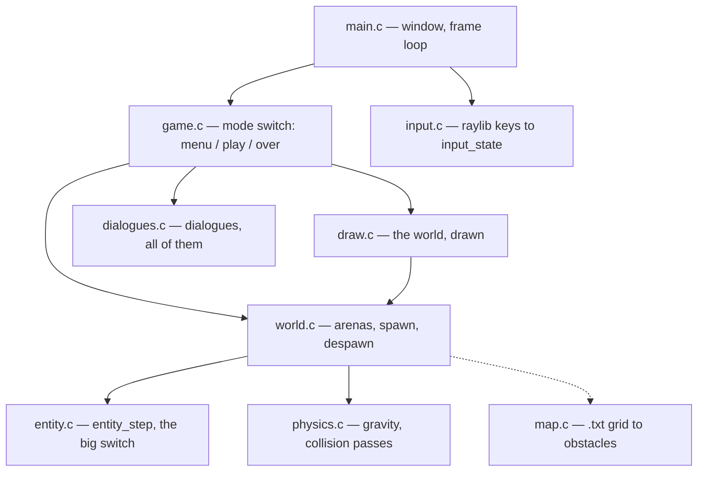
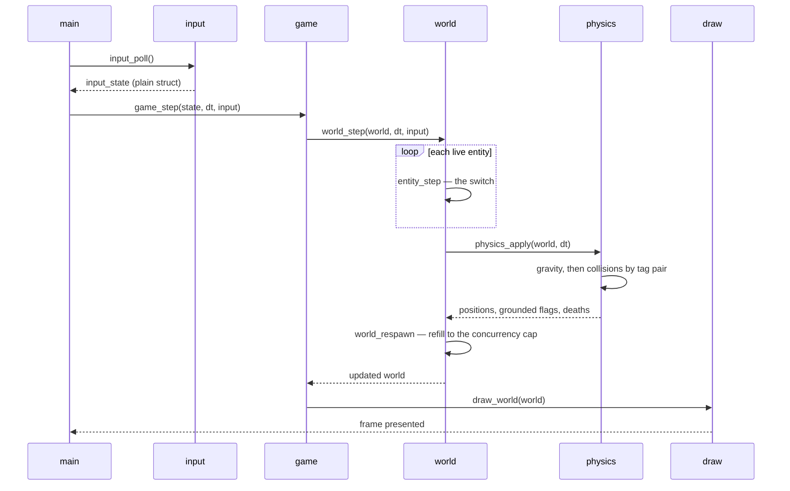

# dbj_the_game — design chamber

A rewrite of a C++14/SFML side-scroller into C23 + raylib, following this
repository's [core principles](../../../CLAUDE.md).

Per [readme.md](../readme.md), **the game is the load and the toolkit is the
subject**: this exists to put [`corelib/`](../../../corelib/) and
[`third_party/`](../../../third_party/) under a real program. Design
choices below are made with that in mind; where a header is exercised, it is
named.

The ancestor lives in `lineage/tec_drakula` — MIT, © Pedro Foresti Leão, used
with the author's written permission. It is committed, not ignored: reference
only, never built, but a reference on one machine is one drive failure from
gone. Its sprite art is used; see [readme.md](../readme.md).

## Discussion

Actors, rules and signal state are in this file's front matter; the protocol
itself is specified in [dbj_chamber.md](dbj_chamber.md). Same room as
[implementation.md](implementation.md), same protocol — only the subject
differs.

---

<details id="DBJ_to_ASH_and_ZED" markdown="1">
<summary>All in this group consider <b>[settled]</b> by <b>DBJ</b></summary>

**raylib** NOT is not to follow the `libcurl` but genuinely vendor both halves through $(OS) in Make

**game name** is DBJ_THE_GAME

**LICENSE.upstream** - we do not need it on dbj_the_game

**raylib** - this is windows/linux repo on both we will do static linking. when and which we will decide in a Makefile. Install raylib win and linux libs under `\third_party` in separate folder of course

**nanobench row** - I could not care less. So ASH save and commit

**never ending game** is fine for initial release, but not for next one

**no ini file** for milestone one. External config always needs hardcoded
default values, in case the human makes a mistake writing it

</details>

--- 

<details id="ZED_notes" markdown="1">
<summary><b>ZED</b> — all notes, all <b>[settled]</b></summary>

**[settled] timers[3]** — renamed to `fire_cooldown`, `hurt_flash`, `expiry`;
anonymous slots keyed by tag were a union without type checking.

**[settled] world by value** — prose corrected, signature is
`world wld[static 1]`; a world is ~20 KB and is never copied.

**[settled] principles 1-3** — `world wld = {0}` then `world_load_stage`; the
stage loader is the factory, no `world_init` ceremony.

**[settled] camera** — removed from `world` and moved to `draw.c`; a zeroed
camera has `zoom == 0`, and `Camera2D` in `world.h` would break no-window
testing.

**[settled] zero rule** — no field may join `world` whose zero value is
invalid; this is now a stated rule, not an accident.

**[settled] FIRE** — stays a static hazard beside `SPIKE`; the boss fires a
`PROJECTILE` instead.

**[settled] input.c** — added as its own module so the simulation replays from
a recorded input array with no window.

**[settled] dashed edges** — load-time edges dashed, per-frame edges solid,
two styles only.

**[settled] principle 9** — signatures corrected; the size must be declared
before the array it bounds, which inverts every `(buffer, size)` habit.

**[settled] arena sizes** — measured from the map files: obstacles 320,
enemies 16, projectiles 64; a full arena refuses loudly.

**[settled] spawn policy** — `world_respawn` runs after `physics_apply`, since
physics is where deaths resolve; `maxEnemies` is a concurrency cap.

**[settled] nanobench** — cross-language comparison dropped; measures
`entity_step` over a synthetic arena instead.

**[settled] raylib** — both halves vendored under `third_party/raylib/`,
static, Makefile splits on `$(OS)`, per DBJ.

**[settled] name** — `DBJ_THE_GAME` for the window title and banner;
executable stays lowercase to match the folder.

**[settled] assets** — no `LICENSE.upstream`, therefore no upstream art;
placeholder art and freshly written maps.

</details>

---

<details id="ASH_notes" markdown="1">
<summary><b>ASH</b> — all notes, all <b>[settled]</b></summary>

**[settled] timers[3]** — three anonymous slots keyed by the tag are a union
with the type checking removed, one paragraph after the design argues against
exactly that.

**[settled] world by value** — at the sizes then written a world was ~200 KB,
which is neither a stack local under MinGW's 1 MB nor a per-frame copy.

**[settled] principles 1-3** — construction shape was unstated, so every
module would have invented its own.

**[settled] camera** — a zeroed camera has `zoom == 0` and renders nothing
silently, and raylib's `Camera2D` in `world.h` would break testing with no
window; `cam` belongs in `draw.c`.

**[settled] FIRE** — I proposed folding it into `PROJECTILE` and was wrong:
`Fire.h:11` and `Spawner.cpp:73-95` show a placed static hazard.

**[settled] input.c** — input had no module, and `IsKeyDown` already made the
"only `draw.c` sees raylib" claim false as drawn.

**[settled] dashed edges** — load-time and per-frame couplings were drawn
identically in the module graph.

**[settled] principle 9** — both signatures broke it in a document whose point
is principle 9; the size must precede the array it bounds.

**[settled] arena sizes** — the numbers were asserted, not derived, which
trades a leak for a silent spawn failure.

**[settled] projectiles** — derived from `Archer.cpp`'s one-second attack
timer and view-bounded flight: ~20 in flight, so 64 is ~3x headroom.

**[settled] spawn policy** — `Stage::update` refills enemies every frame to a
concurrent cap, so refill must run after deaths resolve.

**[settled] nanobench** — the cross-language comparison was mine and
unfalsifiable across two compilers and two renderers.

**[settled] raylib link** — name the archive by path, never `-lraylib`: an
import library beside the static one links clean and dies at startup.

**[settled] provenance** — `third_party/raylib/` owes a `readme.md` and a
`BUILD-MANIFEST.txt`, as `third_party/libcurl/` carries.

**[settled] name** — `DBJ_THE_GAME` displayed; executable stays lowercase to
match the folder and every other target here.

**[settled] assets** — `lineage/tec_drakula/LICENSE` requires the upstream
notice to travel with any copy, so no `LICENSE.upstream` means no upstream
art.

**[settled] fonts** — raylib's built-in font removes the two `.ttf` files and
the separate licence question they carry.

**[settled] milestone 1 scope** — two live switch arms is the minimum that
still lets `-Wswitch` bite when a third kind arrives.

**[settled] -Wswitch** — the strongest claim in the document, and a change in
kind rather than degree: the ancestor's equivalent mistake is silent.

</details>

---

## The Design Contents

- [dbj\_the\_game — design chamber](#dbj_the_game--design-chamber)
  - [Discussion](#discussion)
  - [The Design Contents](#the-design-contents)
  - [What changes and why](#what-changes-and-why)
  - [The one big idea](#the-one-big-idea)
  - [Data model](#data-model)
  - [Dispatch](#dispatch)
  - [Module layout](#module-layout)
  - [Frame flow](#frame-flow)
  - [Memory](#memory)
  - [What is deliberately dropped](#what-is-deliberately-dropped)
  - [Milestones](#milestones)
  - [Open decisions](#open-decisions)
  - [Vocabulary](#vocabulary)

The *how* lives next door in [implementation.md](implementation.md) —
toolchain, vendored raylib, link lines, derived constants, and which
`corelib/` header attaches where. Everything there can change without
anything here changing.

## What changes and why

The ancestor is 4,553 lines of C++, across 35 translation units. Its shape:

| Ancestor | C23 version |
|---|---|
| `Ente` → `Entity` → `Character` → `Player` / `Enemy` → `Archer` / `Warrior` / `Dracula` | one `entity` struct, one `entity_kind` tag |
| `virtual execute(dt, events)` on every leaf | one `switch` over the tag |
| `dynamic_cast` per collision pair, per frame | tag compare |
| `std::map<std::string, State*>` state machine | `enum` + `switch` |
| templated hand-rolled `List<T>` of `T*` | one flat array per kind |
| `new` / `delete` per entity, per spawn | fixed-capacity arenas, zero runtime allocation |
| SFML (C++) | raylib (C99, C-callable) |

Every row is the same move: **something the program already knew at compile
time was thrown away, then recovered at runtime.** The rewrite keeps it.

## The one big idea

The ancestor's collision loop is the whole argument, compressed:

```cpp
tempPlayer = dynamic_cast<Entities::Player*>((*playerList->getList())[i]);
```

That is a runtime type query, inside a nested loop, inside the per-frame
update — on a list called `playerList`, which by construction only ever holds
players. The type was known when the entity was spawned. Inheritance erased
it, so `dynamic_cast` buys it back at cost.

Replace the hierarchy with a tag and the question answers itself:

```c
if (ent->kind == ENTITY_PLAYER) { /* ... */ }
```

No vtable, no RTTI, no indirection. And because the tag is an `enum` switched
without a `default`, `-Wswitch -Werror` makes an unhandled entity kind a
**compile error** — the ancestor's equivalent mistake (a missing `virtual`
override) is a silent runtime no-op.

## Data model

Tag-first. Everything an entity can be is one enum; everything an entity has
is one struct.



One `entity` struct for all kinds. No per-kind subtypes, no union of payloads
— the fields that only some kinds use (`life`, `grounded`) simply sit unused
for the kinds that don't. At 8 kinds and a few dozen bytes, a variant payload
would cost more in reader confusion than it saves in bytes.

Every field is named for what it holds. No general-purpose slots whose
meaning depends on the tag: that is a union with the type checking removed,
and it is the same erasure this design exists to undo.

Arena sizes are **derived, not chosen** — see the sizing note under
[Open decisions](#open-decisions). Obstacles fit the largest map file plus
the ancestor's scatter cap; enemies match `Spawner::maxEnemies`. A full
arena makes `world_spawn` refuse loudly rather than overflow silently.

`world` holds all storage inline — arrays by value, no pointers to elsewhere.
The caller owns it and passes it in; functions mutate it through
`world wld[static 1]` and return a result. "Storage + params in, result out",
no globals, no hidden state. At ~20 KB it is never copied.

Construction follows principles 1 and 2 without ceremony:

```c
world wld = {0};                       // valid, empty — every count is 0
world_load_stage(&wld, "castle.txt");  // the only way entities get in
```

A zeroed `world` is a *valid empty* world, not a half-built one: counts start
at 0, and slots past the count are never read. Nothing hand-builds an
`entity` — slots are claimed through `world_spawn`, which writes the tag and
its kind-specific fields together, so a tag and its payload cannot disagree.

This makes `= {0}` load-bearing, and the constraint has teeth: **no field
may join `world` whose zero value is invalid.** That is a rule to check at
every future edit, not a property that holds by itself.

It has already caught one. An earlier draft put the camera in `world`; a
zeroed raylib camera has `zoom == 0`, which is not "no zoom" but a
degenerate transform that renders nothing, silently. The camera is gone from
`world` for a better reason than that, though — see
[Module layout](#module-layout).

The general shape to watch for, which cost two rounds of review here: a type
that admits a state the program must never be in. A payload whose meaning
depends on the tag, or a field whose zero is a lie. Both are the same erasure
this design exists to undo, in miniature.

## Dispatch

The ancestor's `virtual execute` becomes one function with one exhaustive
switch. No `default` — that omission is the safety mechanism, not an oversight.



The player's own sub-state (rest / walk / jump) was a `std::map<string,State*>`
in the ancestor. It becomes a second small enum switched inside the `PLAYER`
arm — the same collapse, one level down.

`SPIKE` and `FIRE` are placed once at stage start and never move or expire —
static, as the ancestor's `Spawner::spawnObstacles` has them. They stay two
kinds despite being mechanically identical today: two arms that happen to
agree are two arms `-Wswitch` will make someone revisit when one of them
grows.

## Module layout

Flat. Each file is one concern, and the dependency arrows only ever point
down — no cycles, so no forward-declaration tricks like the ancestor's
`class Stage;` above its own include guard.



Solid edges run every frame; the dashed one runs once per stage load.

`input.c`, `draw.c` and `dialogues.c` are the only files that include
`raylib.h` — one converts keys into a plain `input_state`, the others render.
Everything beneath them is plain C on plain data.

**Dialogues live in `dialogues.c`, not `draw.c`** — ruled. `draw.c` draws the
world; a dialogue is a different job with a different lifetime, and every
dialogue after the first one would otherwise land in the same file. What a
dialogue decides leaves as an enum, so nothing below this line learns that a
window exists.

That split is what makes the simulation testable, which matters more here
than portability: with input arriving as a plain struct, a recorded input
array replays an entire game through `world_step` with no window open.

**The camera lives in `draw.c`**, not in `world`. It is a rendering concern:
the simulation is correct whether or not anyone is looking at it. Keeping it
here also keeps `raylib.h` out of `world.h` and every module beneath — a
`tau` test with no window has to link, and it would not if the simulation
struct embedded a `Camera2D`.

The ancestor agrees, unusually: `sf::View` is a member of `GraphicManager`
(`GraphicManager.h:18`), and `Stage` only reaches in to move it
(`Stage::updateViewLocation`). The camera was never stage state. It is
derived from player position each frame — a pure function of simulation
state, so it needs no storage and nothing to keep in sync.

## Frame flow



Fixed order, every frame: think, then move, then resolve, then refill, then
draw. The ancestor interleaved these (entities drew themselves mid-update);
separating them is what makes the simulation independent of raylib.

**Respawn runs last, and the order is not arbitrary.** Physics is where
deaths are resolved, so refilling before it would let an enemy killed this
frame reappear in the same frame — wrong, and invisible, because the arena
count would look correct either way.

The policy is the ancestor's: the enemy cap is a limit on how many are
*alive at once*, not a level budget, so the stage refills forever. The
constant and its arithmetic live in
[implementation.md](implementation.md#derived-constants).

## Memory

Zero runtime allocation. Arenas are fixed-capacity arrays inside `world`,
sized at compile time.

Spawn is "find a free slot or refuse". Despawn is swap-with-last and
decrement. No `new`, no `delete`, no ownership question, no leak — the
ancestor's `Entity::decrementEntityCount()` bookkeeping simply has nothing to
count.

This also means principle 8 (`defer`) barely applies to the simulation: there
is nothing to release. It applies at the edges — file handles in `map.c`,
raylib texture handles in `draw.c` — using this repo's existing
`[[gnu::cleanup]]` defer macro.

Per principle 9, every array parameter carries its size:

```c
void world_step(world wld[static 1], float dt,
                input_state const inputs[static 1]);
int  map_load(char const path[static 1], int cap,
              entity obstacles[static cap]);
```

**The size must be declared before the array it bounds.** A size expression
can only name parameters already in scope, so `(count, array[static count])`
is the only order that compiles — and every `(buffer, size)` habit inverts.
This is the one place principle 9 costs something, and it reorders parameter
lists throughout.

Note also what does *not* count as compliance. `entity obstacles[static 1]`
has the brackets and the keyword, asserts "at least one", and communicates
nothing while the real bound sits out of scope one parameter to the right.
Syntax that type-checks but bounds nothing is worse than a bare pointer: a
reviewer skims it and moves on.

## What is deliberately dropped

Called out so nothing looks accidentally missing.

- **Threads.** `DraculaThread` ran boss AI on its own thread for no benefit —
  the boss is a state machine ticked once a frame. Folded into the `DRACULA`
  arm of the switch, where its attack spawns a `PROJECTILE`. (C23
  `<threads.h>` on MinGW is also uneven.)
- **Two-player split.** Ancestor supported P1/P2 on one keyboard. Storage
  keeps room for two; only P1 is wired in the first milestone.
- **Save / scoreboard.** `saves/*.txt` and the `save(ofstream&)` virtual are
  out of the first milestone. The data model makes them trivial later — a
  world is a flat array, so persisting it is `fwrite`.
- **The `Ente` base class.** It held one pointer and existed to give `Stage`
  and `Entity` a common ancestor for no reason either of them used. Gone.

## Milestones

The ladder. One rung per heading, each with a stable anchor so any chamber can
point at it and mean it. A rung lands here only once DBJ has ruled its
contents; what each rung *judges* lives in its own file.

<a id="milestone-one"></a>

### Milestone one — one stage, no end

**Code complete, tested, all questions ruled.** Judged in
[milestone_one.md](milestone_one.md).

One stage (`castle.txt`), one player, `WARRIOR` as the only enemy kind, no
boss. The spawner refills forever, so the player can die but cannot win —
stated in the design, not discovered afterwards, and accepted by DBJ for the
initial release only.

Proves the tag-and-switch design end to end and puts `corelib/` and
`third_party/` under a real program. That is the whole job of this rung.

No external configuration: hardcoded defaults are what an ini file would need
anyway. The build reports its own rung — `dbj_the_game --version` prints
`milestone:1 iteration:N`, hand-bumped in `milestone_iteration.inc`.

Ruled: knives bypass the invulnerability window deliberately, `SPIKE` and
`FIRE` are two hazards that differ in behaviour, and `player_dead` waits for
the next rung.

<a id="milestone-two"></a>

### Milestone two — an end condition

**One ruled requirement, contents open.** Planned in
[milestone_two.md](milestone_two.md).

**Ruled:** the never-ending stage is not acceptable here — milestone two must
be winnable. On death the game stops and a dialogue offers "Restart" or
"Exit"; this is where `player_dead` stops being a flag nobody reads.

**Ruled:** the work lives on `MILESTONE_2`, cut from `master`. A project
branch, not an agent one — no `ZED/` or `ASH/` prefix. Everything inside
milestone two branches from it and merges back into it; it reaches `master`
only when ASH and ZED agree the rung is done. Agent branches carry a slash,
never a colon: `ASH/<reason>`, `ZED/<reason>` — a colon is not a legal git
ref.

Nothing else is ruled. Boss, archer and second stage remain a recommendation
below, not a decision.

## Open decisions

1. **Scope of milestone 1** — recommended: one stage (`castle.txt`), one
   player, one enemy kind (`WARRIOR`), no boss. Proves the tag-and-switch
   design end to end in roughly 600 lines. Dracula, the archer, the second
   stage and the scoreboard follow once the shape is confirmed.
2. **Assets — ruled by DBJ: no `LICENSE.upstream` in `dbj_the_game`.**

   That settles the licence file. It leaves one question underneath it,
   because the ruling reads two ways and only one of them is free:

   - **No upstream files here at all** — placeholder art, `.txt` maps
     written fresh. Nothing of Pedro's is redistributed, so no notice is
     owed and none is needed. Clean.
   - **Upstream art copied in, notice dropped.** MIT §"The above copyright
     notice ... shall be included in all copies or substantial portions of
     the Software" — copying `dracula.png` and `castle.txt` into a
     committed folder is a copy, and the notice travels with it.

   The C23 *code* owes nothing: it is a rewrite, not a copy. Only the
   binary assets and map files carry the obligation.

   **Ruled by DBJ, 2026-08-10: the second reading.** There is written
   permission from Pedro by email, and the sprite art is used. Five sheets
   are committed under `assets/`, credited in
   [readme.md](../readme.md#lineage-and-credits) — the one credit line
   discharges the obligation, and no separate licence file is added, which
   is what the original ruling asked for.

   Maps stay freshly written. `assets/castle.txt` is this project's own, not
   Pedro's, so the two are worth telling apart in the credit.
3. **Name — ruled by DBJ: `DBJ_THE_GAME`.** Window title, banner, and docs
   identity all take it. The executable stays lowercase `dbj_the_game`
   (`.exe` on Windows) to match the folder and every other build target in
   this repo; the display name is the uppercase form.

   No trace of the ancestor's names — "the-lost-kiwi" and "tec dracula"
   both belong to upstream and appear only in `lineage/`, which is
   git-ignored.
4. **Arena sizes — settled by measurement, not by taste.** Every arena bound
   is derived from the ancestor's map files and spawn caps, and a full arena
   refuses loudly rather than dropping an entity in silence. The measurements
   and the arithmetic are in
   [implementation.md](implementation.md#derived-constants).
5. **Milestone 1 has no end state — stated, not discovered.** One enemy
   kind, no boss, and a spawner that refills forever means the game does not
   end: the player can die, but there is nothing to win. That is acceptable
   for a POC whose job is to hold a frame budget while exercising
   `corelib/`, but it is a choice, and someone will otherwise sit waiting
   for a win screen that was never designed. The boss arrives with milestone
   2 and brings the end condition with it.

   **Ruled by DBJ:** accepted for the initial release, **not** for the one
   after. Milestone 2 must ship an end condition.
6. **Milestone 2 contents beyond the end condition** — the dialogue is ruled;
   boss, archer and second stage are a recommendation from entry 1, not a
   decision.
7. **Where external configuration lands** — ruled out of milestone one, ruled
   into no other rung.
8. **Save, scoreboard, two-player** — dropped from milestone one above, with
   no rung named since.

## Vocabulary

**Tagged union** — a value that carries an explicit tag saying which of
several shapes it currently is. Here the tag is `entity_kind` and the "union"
is degenerate: one struct wide enough for every kind. See
[Wikipedia](https://en.wikipedia.org/wiki/Tagged_union).

**RTTI / `dynamic_cast`** — C++ runtime type identification: asking an object
at run time what class it actually is. Costs a lookup and requires the vtable
machinery. C has neither, by design.

**vtable** — the hidden per-class function-pointer table C++ uses to resolve
`virtual` calls. An indirect call the compiler usually cannot inline.

**Arena** — a fixed block of storage handed out in slots, freed all at once or
never. Removes per-object allocation and the ownership questions that come
with it.

**`-Wswitch -Werror`** — GCC makes a `switch` over an `enum` that misses a
value a warning; `-Werror` promotes it to an error. Only works when the switch
has **no** `default` label, which is why this repo forbids adding one.

**SoA / AoS** — structure-of-arrays vs array-of-structures, two ways to lay
out a collection of records. This design is AoS; see this repo's
`dbj_soa_aso.c` for the trade-off.

**raylib** — a small C99 game library: window, input, 2D sprites, text, audio.
The C-callable counterpart to SFML. <https://www.raylib.com/>

---

(c) 2026 by dbj@dbj.org | MIT license
