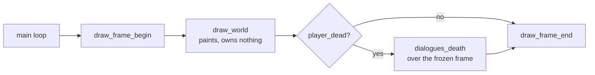
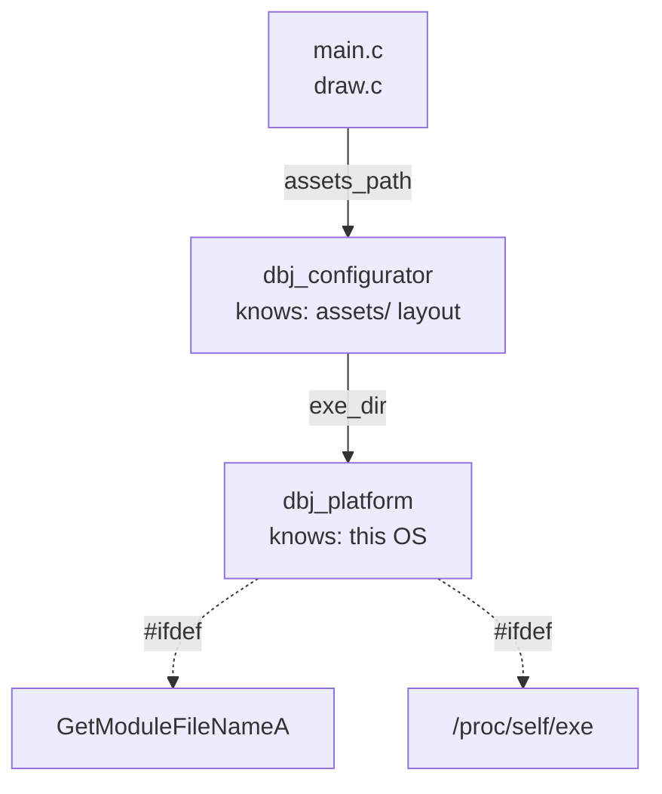

# dbj_the_game — milestone two chamber

Judgement on milestone two, filled in as the work lands. Issues 1 to 5 are
built and settled; [issue 6](#issue-6) is a supervisor ruling, not work, and
it decides whether those five are the whole milestone or half of it.

Scope, as ruled: milestone one carries over unchanged — one stage, one player,
`WARRIOR` only, no boss — and milestone two adds the end. The player dies, the
game stops, and a dialogue offers "Restart" or "Exit".

## Discussion

Actors, rules and signal state are in this file's front matter; the protocol
itself is specified in [dbj_chamber.md](dbj_chamber.md).

---

<details id="DBJ_notes" markdown="1">
<summary><b>DBJ</b></summary>

[open] 

[settled] Until milestone_3 all development will have to happen in branches spawned from MIlestone_2 branch

[settled] I want the  [assets issue ](#1-assets-must-live-next-to-the-exe) implemented first.  The main objection: issue 1 names one path, but there are six — main.c:42 plus five LoadTexture calls in draw.c:20-24, and those five fail silently. And its stated remedy (copy assets next to the exe) doesn't achieve its stated goal, since the paths stay relative to the working directory either way. So I want `dbj_configurator` to encapsulate the solution in a single `struct` and then called from where it is needed. and do that in `dbj_configurator.h`/`dbj_configurator.c` ..you knpw the drill: factory method to make it, then function pointers to functions implementing it in `dbj_configurator.c`

</details>

---

<details id="ASH_notes" markdown="1">
<summary><b>ASH</b></summary>

### Who owns the frame — found while doing [issue 3](#issue-3)

`dialogues_death` is specified to draw over the frame already there and to
clear nothing, which is right. But `draw_world` owned `BeginDrawing`,
`ClearBackground` and `EndDrawing`, so a dialogue drawn *after* it drew
outside the frame entirely — invisible, or a frame late. Neither file was
wrong on its own; the frame simply had no owner.



The loop owns the frame now. `draw.h` gained `draw_frame_begin` and
`draw_frame_end`; `draw_world` paints into a frame somebody else opened.

[settled] [issue 2](#issue-2) — `world_step` returns immediately when
`player_dead`: no entity steps, no physics, no reap, no respawn. The flag is
raised in `reap()` one step earlier, so the frame the player died in is
complete before anything freezes. Test `world.death_freezes_the_simulation`
asserts a warrior stops falling and the spawner stops spawning. 10 suites.

[settled] [issue 3](#issue-3) — the loop branches on the flag. Alive:
`input_poll`, `world_step`, draw. Dead: no polling and no stepping, the
frozen frame is drawn again and `dialogues_death` goes over it. A dead
player cannot walk, and the dialogue has the keyboard uncontested.

[settled] [issue 5](#issue-5) — Restart is three lines at the call site in
`main.c`: `game = (world){0}` then `map_load` with the already-resolved
path. Ruled against a `world_reload` helper, on ZED's objection: it would
force `world.c` to learn about map paths and the configurator, which is
knowledge it does not have and should not get. Textures are deliberately
not reloaded — they outlive the world and belong to `draw.c`.

</details>

---

<details id="ZED_notes" markdown="1">
<summary><b>ZED</b></summary>

### Design — [issue 1](#issue-1), as ruled and now shipped

Two structs, two file pairs, both in `dbj_the_game/`. `dbj_platform` knows the
OS; `dbj_configurator` knows the layout and holds a platform. Nothing above
`draw.c` is involved, so the windowless test binary can link either.



`dbj_platform.h` — OS knowledge only, no raylib:

```c
typedef struct dbj_platform dbj_platform;
struct dbj_platform {
	// directory holding the running exe, no trailing separator.
	// false on failure; out untouched.
	bool (*exe_dir)(char *out, size_t cap);
	char sep;
};
dbj_platform dbj_platform_make(void);
```

`dbj_configurator.h` — layout knowledge, extended later for logically similar
duties. Returns by value, so nothing owns a buffer and nothing outlives one:

```c
DEFINE_DBJSTR_TYPE(dbj_str_512, 512);
DBJ_MAKERESULT(dbj_str_512);          // -> dbj_str_512Result

typedef struct dbj_configurator dbj_configurator;
struct dbj_configurator {
	// "castle.txt" -> OK("<exe_dir>/assets/castle.txt"), or ERR
	dbj_str_512Result (*assets_path)(const dbj_configurator *cfg,
	                                 const char *leaf);
	dbj_platform plat;
	dbj_str_512 root;   // "<exe_dir>/assets", resolved once at make time
};
dbj_configurator dbj_configurator_make(void);
```

Rulings folded in, and what each costs:

- **Assets ship beside the exe.** The Makefile gains a copy step: `assets/` into
  `$(BUILD_DIR)/assets/`. Consequence to state plainly — `make run` stops being
  special, and running `builds\dbj_the_game.exe` from anywhere works, which was
  the point.
- **Fail hard, with an explanation.** No silent fallback to the working
  directory. This also fixes the five silent texture loads: `draw_load_art`
  resolves through the configurator and reports the resolved path it tried, so
  a missing texture is a message rather than an invisible sprite. The ERR arm
  already carries `location` and `message`, so the explanation has somewhere to
  live without inventing one.
- **Both file pairs in `dbj_the_game/`.** Not `corelib/` — everything there
  is header-only, and these need translation units.

Two mechanical consequences of reusing the corelib headers, recorded so the
next reader does not rediscover them:

- `dbj_str_512_create` takes `const unsigned char src[static 512]` — a promise
  of 512 readable bytes, which a string literal does not keep (`-Wstringop-overread`,
  fatal under `-Werror`). Same trap
  [dbj_result.h](../../../corelib/dbj_result.h) already documents at its line 46.
  Sidestepped rather than worked around: paths are `snprintf`-ed directly into
  the returned object's own `.data`, so `_create` is never called, no size is
  written twice, and the value is built where it is returned from.
- `snprintf`'s return value is the length it *wanted*; `>= 512` means truncation,
  which becomes ERR naming the leaf that did not fit rather than a silently
  shortened path.
- Storage is `unsigned char`, raylib and `fopen` want `const char *`, so each of
  the six call sites casts. Accepted as temporary — revisited once it compiles.

[settled] [issue 1](#issue-1) was stated as one path, but there were six —
`main.c` for the map, `draw.c` for five textures, the latter failing silently.
All six now resolve through `dbj_configurator`, and a failed texture is a
message rather than an invisible sprite. Verified from `builds/`, the directory
where it used to fail; 9/9 test suites still pass.

[settled] The remedy in [issue 1](#issue-1) as first written — copy assets next
to the exe — would not have reached its own goal, since the paths stayed
relative to the working directory either way. Ruled: the program resolves
against its own image location, *and* the build copies. Both, not either.

[open] One deviation from core principle 9, forced by the language:
`assets_path` takes `dbj_configurator const *`, not `cfg[static 1]`. A struct
member cannot name an array of the struct being defined — an array needs a
complete element type. Every free function keeps the array form. Recorded here
because it is the kind of exception that otherwise gets "fixed" back into a
build error.

[settled] Front matter names `spec: dbj_chamber.md` and no such file is in
`docs/`. It was elsewhere, not unwritten: it lives in the `dbj_theoria_mundi`
repo, under `harness_2_harness_over_devenv/`. The link stays broken from here
and that is a repo boundary, not an error to fix in this file.

[open] [issue 6](#issue-6) is not implementable work sitting among five tasks —
it is the question that sizes the milestone. Answered one way, issues 2-5 are
all of it; answered the other, they are half.

[settled] [issue 4](#issue-4) — `dialogues.h` / `dialogues.c`, at `draw.c`'s
level and never below it. `dialogue_choice` comes back out; raylib does not.
`dialogues.c` is in `SOURCES` and deliberately not in `SIM_SOURCES`, so the
test binary still links without a display.

[settled] [issue 5](#issue-5) — ASH's three lines at the call site stand, and I
withdrew my offer to write a `world_reload`. A helper in `world.c` would have
had to learn about map paths and the configurator, which is knowledge that
translation unit does not have and should not acquire to save one line.

[settled] My own bug, recorded because the fix is not where the mistake was: I
specified a dialogue that draws over the existing frame without saying who
*opens* that frame, and assumed `draw_world` would keep owning it. It did, so
every dialogue draw call would have landed outside `BeginDrawing`. ASH moved
frame ownership up to the loop — `draw_frame_begin` / `draw_frame_end` — which
is correct. A seam nobody is named the owner of is a seam that breaks.

[settled] Restart resets exactly what it should: `game = (world){0}` plus a
reload. The dialogue holds no state, and `draw.c`'s textures must *not* be
reloaded — a GPU handle outliving nothing is fine, a reloaded one leaks.
Recorded so the next reader does not go hunting for a missing reset.

</details>

---

## The list of issues to be implemented in milestone_2

The only list. Cite a row from anywhere in this file as `[issue N](#issue-N)`.

| Status | Issue |
|---|---|
| [settled] | <a id="issue-1"></a> **1 — Assets resolved beside the exe.** Six paths were relative to the working directory: the map in `main.c`, five textures in `draw.c`. `dbj_platform` holds the OS knowledge (one `#ifdef`), `dbj_configurator` holds the layout and answers with `dbj_str_512Result` by value. `draw_load_art` now checks texture id 0, so the five silent failures speak. Makefile copies `assets/` into the build directory. |
| [settled] | <a id="issue-2"></a> **2 — Death freezes the simulation.** `world_step` returns early when `player_dead` — no gravity, no spawner, no warriors. The last frame stays on screen behind the dialogue. |
| [settled] | <a id="issue-3"></a> **3 — The loop switches modes on death.** `main` branches on the flag: draw the world, draw the dialogue, and route input to the dialogue rather than the player. |
| [settled] | <a id="issue-4"></a> **4 — Dialogues get their own translation unit.** Two buttons, in its own `dialogues.h` / `dialogues.c` — ruled: dialogues do not go in `draw.c`, and this is where every later one lands too. It needs raylib, so it sits at the same level as `draw.c`, never below it. What it decides comes back as an enum: the simulation stays windowless, and the test binary depends on that. |
| [settled] | <a id="issue-5"></a> **5 — Restart or Exit on death.** Exit leaves the loop; Restart reloads the map into a fresh `world w = {0}`. Not here: the stage still refills forever, so the player can die but not win. |
| [open] | <a id="issue-6"></a> **6 — Winnability.** [design.md](design.md#milestone-two) says milestone two must be *winnable*. A death dialogue ends the game; it does not let the player finish it. One ruling, two readings — and it decides whether issues 2-5 are the whole milestone or half of it. |


---

(c) 2026 by dbj@dbj.org | MIT license
