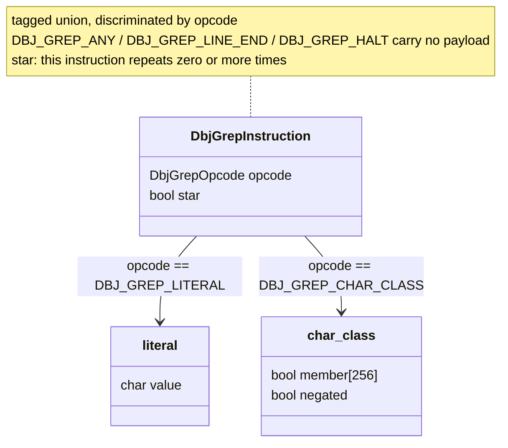
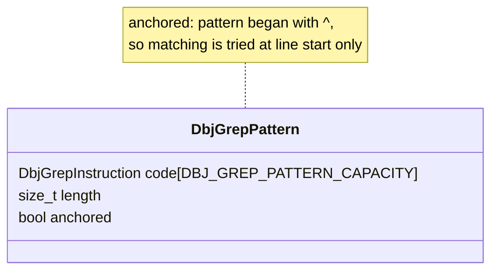
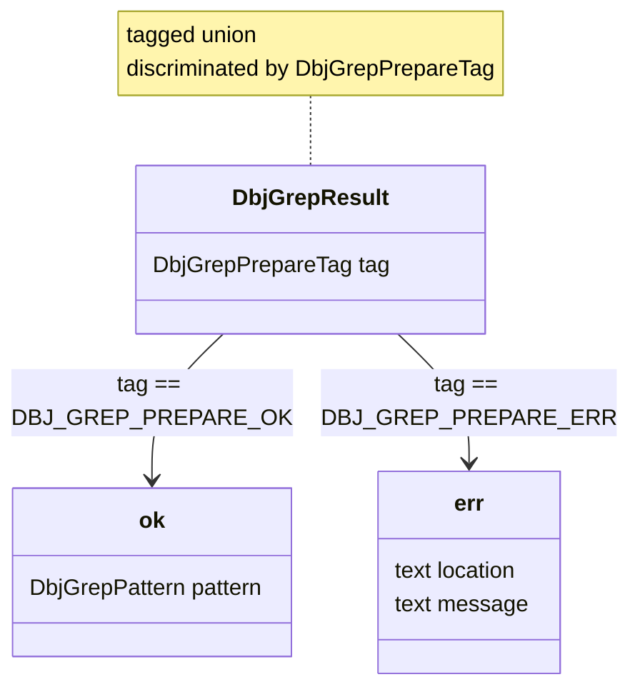
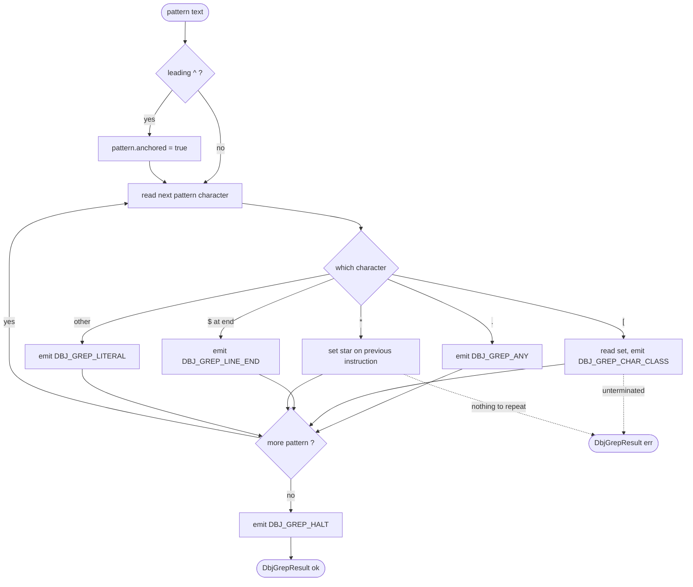
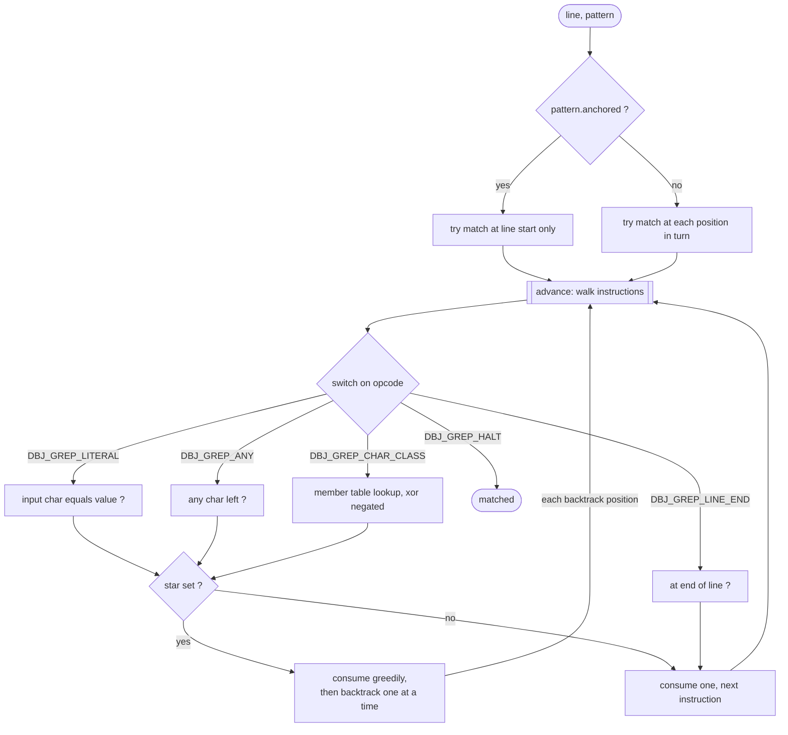

<h1> Ken Thompson's grep — C23 tagged union port </h1>

> First time visitor can understand easily what is this all about. And we
> can explain it better.
>
> We are enjoying the metapresence of [DBJ Taxonomies](https://method.dbj.org/taxonomy_core.html).
> Thus we can communicate where are we in the information space with this doc.
>

```
Category:       Implementation
Capability:     Development
```

**Table of Contents**
- [What this is](#what-this-is)
- [Files](#files)
- [Requirements](#requirements)
- [Build \& Run](#build--run)
- [Limits](#limits)
- [Provenance, and what the legacy listing is](#provenance-and-what-the-legacy-listing-is)
- [Top-level logical design](#top-level-logical-design)
  - [The 1975 encoding, and what is wrong with it](#the-1975-encoding-and-what-is-wrong-with-it)
  - [**DbjGrepInstruction**](#dbjgrepinstruction)
  - [DbjGrepPattern](#dbjgreppattern)
  - [DbjGrepResult](#dbjgrepresult)
  - [Prepare](#prepare)
  - [Match](#match)
- [What was deliberately not carried over](#what-was-deliberately-not-carried-over)

# What this is

A C23 re-implementation of the regular expression engine at the heart of
Ken Thompson's Version 6 Unix `grep` (c. 1975), rewritten so the opcode
stream — which the original encoded as untyped bytes — becomes an
explicit tagged union dispatched by an exhaustive `switch`.

This is the same exercise as [`tribute_to_tony/`](../tribute_to_tony/general_design.md),
applied to a piece of code that genuinely predates the idea being
demonstrated. The concept itself (Hoare 1966, Simula, OOP's dropped
`inspect`, Rust's `enum`+`match`) is written up at
https://iceberg.dbj.org/posts/tonyhoare/ — it is not re-derived here.

The interest is that the 1975 `advance()` is *already* a tagged dispatch.
Thompson wrote the shape by hand, in a language with no way to express
it. The port does not add the pattern; it names what was always there.

# Files

| File | What it is |
|---|---|
| [dbj_grep.h](dbj_grep.h) | The engine: `DbjGrepInstruction`, `DbjGrepPattern`, `DbjGrepResult`. STB style — declaration-only unless `DBJ_GREP_IMPLEMENTATION` is defined first. |
| [dbj_grep_test.c](dbj_grep_test.c) | Driver: a built-in self test, plus a working grep mode. Builds to `dbj_grep`. |
| [ken_thompson_grep.md](ken_thompson_grep.md) | The legacy listing this port started from. **Not** authentic V6 source, despite claiming to be — see [Provenance](#provenance-and-what-the-legacy-listing-is) below. |

This file is both the folder readme and the design document — read the
[Top-level logical design](#top-level-logical-design) below before
changing the code.

# Requirements

- MINGW (GCC 15+) with C23 support
- `-I $DBJ_CORELIB` for `<dbj_simple_log.h>` and `<dbj_clintro.h>`
- No third-party dependencies, no allocation anywhere

# Build & Run

Use `make.cmd` found here.

```cmd
make
```

The executable lands in `$DBJ_BUILDS`, falling back to `../builds` —
see [build.md](../build.md).

```cmd
dbj_grep <pattern> [file...]  :: grep, reading file(s) or stdin
dbj_grep --selftest           :: run the built-in self test
dbj_grep --help               :: print usage
```

Supported pattern syntax, as in V6 `grep`:

| | |
|---|---|
| `.` | any one character |
| `*` | zero or more of the preceding item |
| `[set]` | one character from set, ranges allowed (`a-z`) |
| `[^set]` | one character not in set |
| `^` | start of line (only in first position) |
| `$` | end of line (only in last position) |

# Limits

Nothing is allocated, so every limit is a fixed buffer size. Each one
is checked where the input can exceed it, and an over-limit input is
always a reported error — never a truncation, never undefined
behaviour. All are `#ifndef`-guarded, so they can be overridden at
compile time.

| Limit | Default | Bounds | Exceeded ⇒ |
|---|---|---|---|
| `DBJ_GREP_PATTERN_CAPACITY` | 256 | instructions in one prepared pattern | `"pattern too long"` |
| `DBJ_GREP_PATTERN_TEXT_MAX` | 1024 | characters of pattern text | `"pattern text too long"` |
| `DBJ_GREP_ERROR_TEXT_SIZE` | 512 | each of `err.location` / `err.message` | truncated by `snprintf` |
| `DBJ_GREP_CHAR_CLASS_SIZE` | 256 | membership table — one entry per `unsigned char`, so not exceedable | — |
| `GREP_LINE_SIZE` | `BUFSIZ` | one input line read | split across reads, not truncated |
| `GREP_MAX_FILES` | 256 | files named on one command line | `"N files named, at most M accepted"` |

The first two both exist because they bound **different** things.
`DBJ_GREP_PATTERN_CAPACITY` counts instructions; `[a-z]` is five
characters but one instruction, while `abcde` is five of each. A
pattern built from character classes can therefore be enormous while
producing few enough instructions to slip under the capacity check —
which is exactly what happened before `DBJ_GREP_PATTERN_TEXT_MAX` was
added: a 5000-character class was accepted silently.

The self test (`dbj_grep --selftest`) exercises both at their
boundaries, including that a pattern *at* the limit is still accepted,
so an off-by-one cannot creep in unnoticed.

`GREP_MAX_FILES` is the one limit nothing would technically break
without — files are opened and closed one at a time, so there is no
per-file storage to overflow. It exists so that a shell glob expanding
to something absurd is refused out loud rather than ground through.

# Provenance, and what the legacy listing is

[`ken_thompson_grep.md`](ken_thompson_grep.md) is the listing this port
started from — the Ken Thompson legacy, kept in this folder for its own
sake. It is **not** authentic V6 source, despite claiming to be. It is
an LLM reconstruction, and a lossy one. Kept as-is, unfixed, for the
same reason [`tribute_to_tony/analyzed_vibecode/`](../tribute_to_tony/analyzed_vibecode/)
is kept: the unedited baseline is the evidence.

(A `ken_thompson_grep.c` holding a byte-identical copy of that listing
sat alongside it and has been removed — it duplicated the `.md` exactly,
compiled with 40 errors, and was referenced by nothing.)

What is wrong with the listing, briefly:

- The regular expression compiler is **missing entirely**. `compile()`
  is a stub that calls a nonexistent `darcomp()`. Nothing ever writes
  `expbuf`, so `advance()` walks an all-zero buffer.
- The opcodes `CCHR`, `CDOT`, `CCL`, `NCCL`, `CDOL`, `CEOF`, `CSTAR`
  are used but never `#define`d.
- One identifier, `anian`, is simultaneously the `-s` flag, a file
  descriptor, and a struct with a `.bno` member. In the real source
  these are three separate things. A bulk rename collided them.
- `anl` is used but never declared.
- `fprint`/`print` are Plan 9 names; V6 used `write(2, ...)`/`printf`.
- The file ends mid-C with a stray markdown fence and prose — it is a
  chat answer pasted into a `.c` file.

So this port is a translation of the *algorithm*, which is recoverable
and well documented, not of that text.

# Top-level logical design

## The 1975 encoding, and what is wrong with it

The original compiles a pattern into `char expbuf[512]` — one flat byte
array holding opcodes and their operands interleaved:

```
pattern:  a.[xyz]*$

expbuf:   CCHR 'a' CDOT CSTAR CCL 4 'x' 'y' 'z' CDOL CEOF
          └──┬───┘ └─┬┘ └─┬─┘ └──────┬───────┘ └─┬┘ └─┬─┘
           2 bytes   1     1        5 bytes       1    1
```

Every opcode has a different payload width, and **nothing in the type
system records that**. The reader is expected to know that `CCHR` is
followed by exactly one byte, that `CCL` is followed by a length-prefixed
set whose length byte counts itself, and that `CDOT` is followed by
nothing. Getting it wrong walks the interpreter into the middle of an
operand and reads it as an opcode.

That knowledge lives only in the programmer's head, and in the matching
pointer arithmetic scattered across `compile()` and `advance()`. The
tagged union's whole job is to move it into the declaration.

## **DbjGrepInstruction**

`DbjGrepInstruction` is the central, tagged type — the direct replacement
for "one opcode byte plus however many operand bytes it happens to
take". A pattern is a plain array of these, so advancing to the next
instruction is `+ 1`, never `ep += *ep`.



Two things changed shape on the way over, both deliberate.

**`star` became a field, not an opcode.** In the original, `CSTAR` is a
separate opcode written *in front of* the item it repeats, and
`advance()`'s `CSTAR` case does `while (*lp++)` — run to end of line,
then back off one character at a time. That only terminates correctly
because the repeated item is always exactly one character wide. The
opcode says "star" but the semantics are "the single next matcher,
starred". Making `star` a flag on the matcher states what was already
true, and stops the `CSTAR` case from having to re-derive it. It also
makes "star with nothing to repeat" unrepresentable rather than a
runtime hazard.

**Character classes became a 256-entry membership table.** The original
stores the class as a length-prefixed list of bytes and does a linear
scan per input character (`cclass()`). The table is O(1) per character,
and — more to the point here — it has one obvious shape instead of an
implicit length convention. `negated` folds the original's separate
`NCCL` opcode into the same arm, since the two differ only in the sense
of the test.

## DbjGrepPattern



Fixed capacity, no allocation — the original's `expbuf[512]` constraint,
carried over honestly rather than replaced with a growable buffer. A
pattern that does not fit is a prepare-time error, exactly as it was.

The literature would call this a *program* — an instruction stream for
the little machine that `dbj_grep_advance` implements, and that is what
`expbuf` was. The name is not used here: `dbj_grep.h` is a library, and
the executable it builds into is itself called `dbj_grep`, so "program"
in a type name would point at the wrong thing twice over.

`anchored` is the original's `circf`/`anl` flag. It is a property of the
whole pattern, not of any one instruction, so it lives here and not in
`DbjGrepInstruction`.

## DbjGrepResult

Standard return type for preparing a pattern: a tagged union returning the
pattern or an error. Same shape as `tribute_to_tony`'s
[`EmailStorageResult`](../tribute_to_tony/general_design.md#emailstorageresult),
for the same reason — the caller must branch on the tag before it can
reach either arm.



## Prepare

V6 called this step *compiling* the regular expression, and Thompson's
function is literally `compile()`. That name is not kept here. Nothing
is compiled in any sense a present-day reader would expect — no code is
generated, no machine is targeted; a pattern string is read once and
turned into an array of `DbjGrepInstruction`, ready to be matched
against as many lines as you like.

`dbj_grep_prepare` names that outcome rather than the mechanism: the
point of the call is that afterwards you *have* something prepared to
match with. The historical term is recorded here, not embedded in the
API where it would mislead.

Pattern text in, `DbjGrepResult` out. No hidden state — the
original wrote into the global `expbuf`; this takes nothing and returns
everything.



Note `*` does not emit an instruction. It reaches back and sets `star`
on the one just emitted — the mirror image of the original writing
`CSTAR` *before* the item. Both encode the same thing; this one cannot
produce a `CSTAR` with nothing after it.

## Match

The exhaustive `switch` — the reason this port exists.



Backtracking is recursive, as in the original — `advance()` calls
itself from the starred case. That is a design constraint inherited on
purpose: it is what makes the engine small enough to read, and it is
also why the 1975 engine has pathological cases. Not fixed here; fixing
it would mean Thompson's *other* famous regex paper (NFA simulation,
CACM 1968), which is a different program.

There is deliberately **no `default:` case** in that switch. Adding an
opcode without handling it is then a compile error under `-Wswitch
-Werror`, which is the entire point — see
[CLAUDE.md](../CLAUDE.md), "Working conventions".

# What was deliberately not carried over

- **`grep`'s flags** (`-v -c -n -b -l -s -e`). This is a POC for the
  matcher, not a CLI utility. The original's flag handling is also the
  part of the file with the least to say about tagged unions — it is
  one `switch` over `char` that sets one global per case.
- **File I/O and the raw block buffer.** `-b` printed the disk block
  number, which stopped being meaningful a very long time ago.
- **The `register` keyword and K&R declarations.** Nothing is lost;
  these are era, not design.
- **Global `expbuf` / `linebuf` / `lnum` / `status`.** Storage and
  parameters in, result out — no hidden state, per
  [CLAUDE.md](../CLAUDE.md), "Working conventions".

---

(c) 2026 by dbj@dbj.org | MIT license
