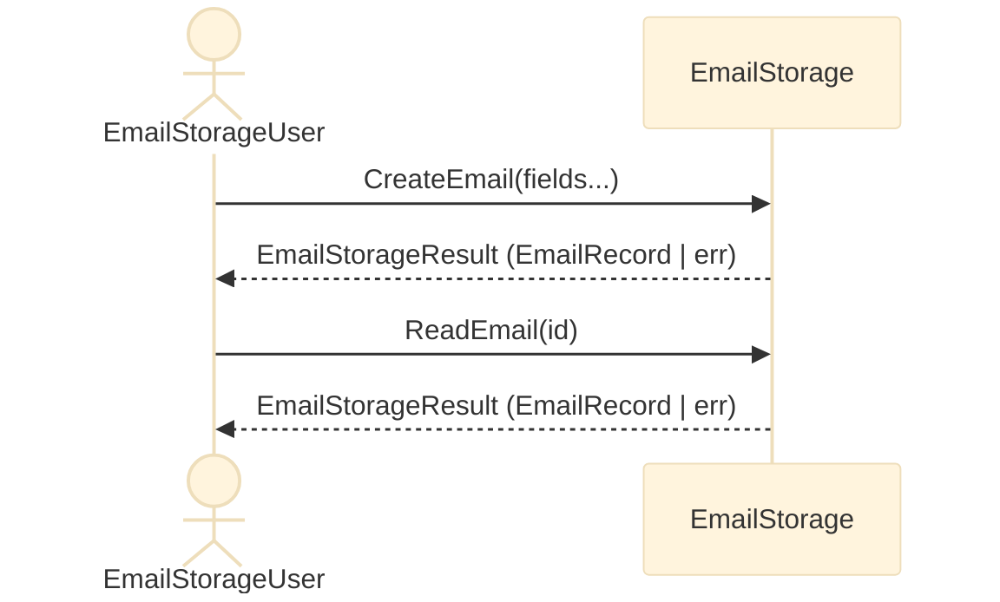
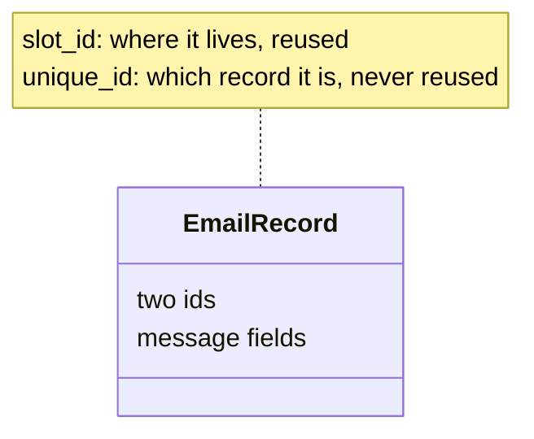
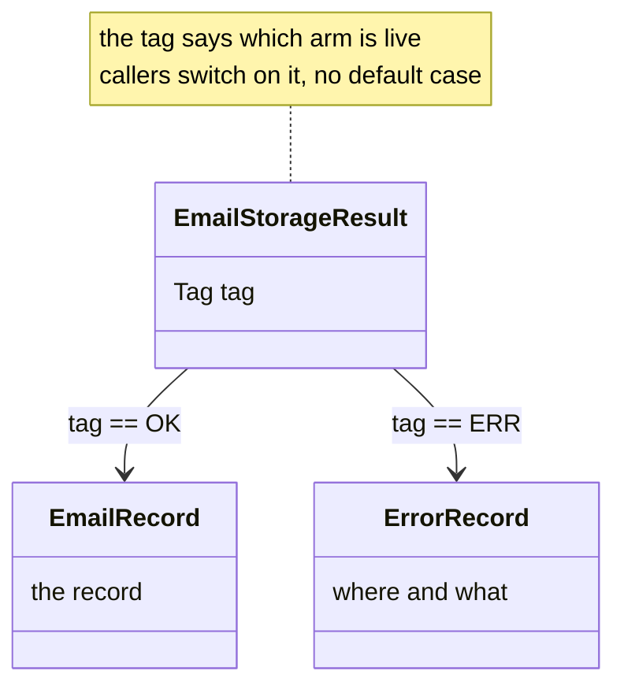
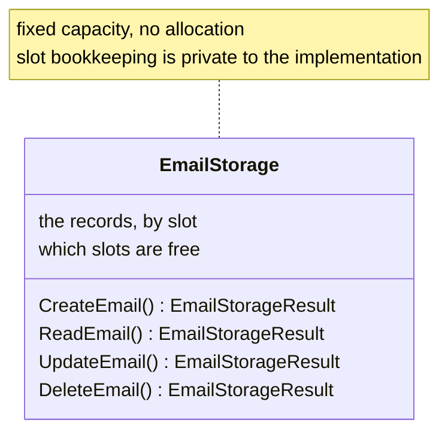
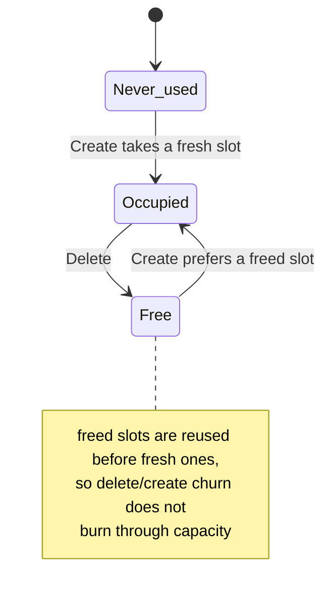

<h1> General Design Notes </h1>

<h1 style="font-size:10rem; font-weight:normal; font-family:georgia"> W.I.P. </h1>


> First time visitor can understand easily what is this all about. And we can explain it better. 
> 
> We are enjoying the metapresence of [DBJ Taxonomies](https://method.dbj.org/taxonomy_core.html). Thus we can communicate where are we in the information space with this doc. 
>

```
Category:       Implementation
Capability:     Development
```

**Table of Contents**
- [Top-level logical design](#top-level-logical-design)
  - [Top level requirement: RQ01](#top-level-requirement-rq01)
  - [User / EmailStorage interaction](#user--emailstorage-interaction)
  - [**EmailRecord**](#emailrecord)
  - [EmailStorageResult](#emailstorageresult)
  - [EmailStorage](#emailstorage)
    - [Free Slots concept](#free-slots-concept)
  - [Note on Multi Threading](#note-on-multi-threading)


# Top-level logical design

## Top level requirement: [RQ01](top_level_requirements.md#rq01-email-crud-application)

## User / EmailStorage interaction


**Notice on user required and assumed behavior**

In order to use this API (Interface) User has to first obtain the instance to the storage. Plus to that solution, is that user can potentially use multiple storages. Minus is that obtaining the storage or storages instances is yet undefined on the system level. For example. System architecture might conclude a single email storage is preferred but has to be externally controlled. Or the opposite. Many/several encapsulated storages. In any case that is out of the scope of this design.

## **EmailRecord**

`EmailRecord` is the central data type — a plain struct. (The
discriminated union in this design is `EmailStorageResult`, below; a
record travels inside its `ok` arm.) Storage is a logical array of
`EmailRecord`s, plus a singly-linked free list threaded through the
same array for slot reuse — a specialized storage for `EmailRecord`s,
not a general one.

There is no table here, so no `ROWID` in the SQLite sense — but the
same distinction is worth naming, since it is exactly what trips
people up: every record carries **two** ids, with two different
lifetimes.

- `slot_id` — a plain array index, what CRUD keys every lookup on. Not
  a permanent identity: a deleted slot's index is reissued to the next
  `CreateEmail`, so the same numeric `slot_id` can belong to a
  different record over time.
- `unique_id` — assigned once on create, never reused, never looked up
  by. It exists purely so a record's identity stays legible even after
  its `slot_id` has been reissued. Its own type, `UniqueId`, is kept
  distinct from `slot_id`'s `EmailId` — the two ids answer different
  questions (which slot vs. which record), so sharing one type made
  that easy to miss.


**Shape**



Field list is in `dbj_email_record.h`.


## EmailStorageResult

Standard return type is: `EmailStorageResult`. It is a discriminated
union, carrying either the `EmailRecord` or an error.

**Shape**



Each arm is a named type of its own — `EmailRecord` and `ErrorRecord` —
rather than a struct written inline in the union. That is what makes
the construction below possible.

**Construction is compile-time.** Because each arm is one named type,
each factory takes exactly one argument, and `_Generic` can pick
between them on the payload's type:

```c
EmailStorageResult r = email_storage_result(some_record);
EmailStorageResult e = email_storage_result(error_record(__func__, "not found"));
```

No caller writes a tag. The payload's type determines the arm *and* the
tag together, so the two cannot disagree; a payload of any other type
fails to compile.

This follows
[the reference implementation](dbj_discriminated_union_reference_implementation.md)
throughout — see its sections "Why not embed a function pointer" (no
pointer is carried in the union or beside it) and "`_Generic` — the
reference implementation". Reading stays a runtime `switch` on `tag`
with no `default`, so `-Wswitch -Werror` fails the build if a tag is
ever added and left unhandled.

**Future improvements**. Notice we say "improvements" not "extensions".

- ~~user configurable size of `location` and `message` char arrays~~ —
  done: `ERROR_RECORD_LOCATION_SIZE` / `ERROR_RECORD_MESSAGE_SIZE` on
  `ErrorRecord`.
- both `location` and `message` in a json format
  - Discuss: why not just one json formatted `payload`?

## EmailStorage

The four CRUD verbs are the whole interface. Every one of them returns
an `EmailStorageResult`; `Read`/`Delete` take a `slot_id`,
`Create`/`Update` take a record.

**Shape**



Storage is one fixed-size array of records, with occupancy and the free
list held alongside it. The bookkeeping fields are an implementation
matter — see `dbj_email_storage.h`.

### Free Slots concept

Storage is a fixed-capacity array of `EmailRecord`s (see the `slot_id`
discussion under EmailRecord above for why a deleted slot's index is
reused rather than retired).

**Slot lifecycle**

A slot is either free or occupied, and the free ones form a stack:



Because a freed slot is handed out again, a `slot_id` identifies a
record only while that record is live — which is the whole reason
`unique_id` exists (see EmailRecord above).

Capacity is exhausted only when every slot has been used and none has
been freed; `CreateEmail` then returns an error result. The link
mechanics of the free stack are in `dbj_email_storage.h`.

## Note on Multi Threading

Currently the design and code do not work in presence of multiple threads. That will be relatively straightforward to solve. We will use a single light mutex to be reachable from MailStorage public API and lock on entry unlock on leaving pattern. For that to be simple and resilient we will use the mandated compiler (GCC 15+) `defer` statement.

---

(c) 2026 by dbj@dbj.org | MIT license
