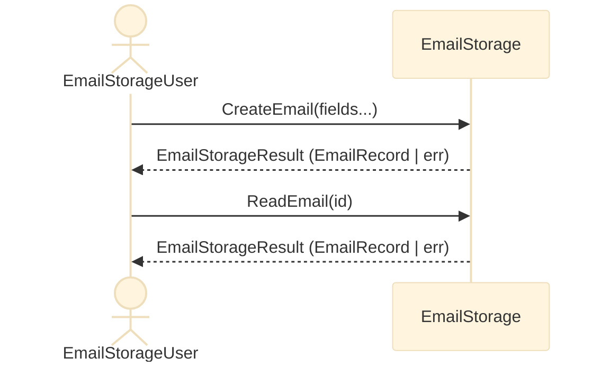

# Design to go with [dbj_discriminated_union.c](dbj_discriminated_union.c)


> **Caveat Emptor**: We are enjoying the metapresence of [DBJ Taxonomies](https://method.dbj.org/taxonomy_core.html). Thus we know where are we in the information space with these endeavor. Top category: **Implementation**. Capability: **Development**. In other word: We know what is this all about. And we can explain it to the reader.
>

**Table of Contents**
- [Design to go with dbj\_discriminated\_union.c](#design-to-go-with-dbj_discriminated_unionc)
- [Top-level logical design](#top-level-logical-design)
  - [Top level requirement: RQ01](#top-level-requirement-rq01)
  - [User / EmailStorage interaction](#user--emailstorage-interaction)
  - [**EmailRecord**](#emailrecord)
  - [EmailStorageResult](#emailstorageresult)
  - [EmailStorage](#emailstorage)
      - [**EmailStorage API**](#emailstorage-api)
      - [Notice on user required and assumed behavior](#notice-on-user-required-and-assumed-behavior)
    - [Current Email Storage API](#current-email-storage-api)
  - [Multi Threading](#multi-threading)


# Top-level logical design

## Top level requirement: [RQ01](top_level_requirements.md#rq01-email-crud-application)

## User / EmailStorage interaction




## **EmailRecord**

- `EmailRecord` is the central, tagged type. 
  - Storage is an logical array of `EmailRecord`s
    - We consider this a specialized storage for `EmailRecords`s
    - `EmailRecord` ID is index on that array
      - we keep this ID also in the record itself for quick retrieval

**Synopsys**

```c
typedef U8TYPE EmailId;

#define EMAIL_ID_EMPTY \
    ((EmailId)0x00) /* reserved — marks empty slot NOT null record */

typedef struct {
    EmailId id;
    char to[64];
    char from[64];
    char subject[128];
    char body[512];
} EmailRecord;

static const EmailRecord EMPTY_EMAIL_RECORD = {.id = EMAIL_ID_EMPTY};

```


## EmailStorageResult

Standard return type is: `EmailStorageResult`. It is a tagged union, returning the `EmailRecord` or an error
```
EmailStorageResult.err
    char[512] : error location (file, function, line_number)
    char[512] : error message
```

**Synopsis**

```c
typedef enum : U8TYPE {
    EMAIL_STORAGE_OK,
    EMAIL_STORAGE_ERR,
} EmailStorageResultTag;

typedef struct EmailStorageResult EmailStorageResult;

struct EmailStorageResult {
    EmailStorageResultTag tag;
    union {
        struct {
            EmailStorageResult (*make)(EmailRecord record);
            EmailRecord record;
        } ok;
        struct {
            EmailStorageResult (*make)(const char* location, const char* message);
            char location[512]; /* file:function:line, e.g. via __FILE__ ":" __func__ ":" ... */
            char message[512];
        } err;
    };
};
```

**Future improvements**. Notice we say "improvements" not "extensions".

- user configurable size of `location` and `message` char arrays, on the `err` struct.
  - that also allows for using char array parameters with size hint
- both `location` and `message` in a json format
  - Discuss: why not just one json formatted `payload`?

## EmailStorage

    - Logically has associated CRUD verbs
      - That is the language it speaks
    - CRUD Verbs are logically executed inside a `EmailStorage` and accessible over its API (Interface)
      - CRUD verbs are dispatch, not data: each verb is a plain function
        - Data is passed in and out as function parameters nad return values
    - CRUD verbs are
      - CreateEmail
      - ReadEmail
      - UpdateEmail
      - DeleteEmail
    - Thus those are the core methods of the `EmailStorage` interface
    - **EmailStorageUser** knows the language of the `EmailStorage`

#### **EmailStorage API**

**EmailStorage API Synopsys 0**

```c
typedef struct EmailStorage EmailStorage;

struct EmailStorage {
    EmailRecord records[/* capacity */];

    EmailStorageResult (*CreateEmail)(EmailStorage* self, EmailRecord record);
    EmailStorageResult (*ReadEmail)(EmailStorage* self, EmailId id);
    EmailStorageResult (*UpdateEmail)(EmailStorage* self, EmailRecord record);
    EmailStorageResult (*DeleteEmail)(EmailStorage* self, EmailId id);
};
```

`CreateEmail`/`ReadEmail`/`UpdateEmail`/`DeleteEmail` are function
pointers carried on the `EmailStorage` instance itself — same "make"
pattern already used by `Result` and `EmailStorageResult` 

#### Notice on user required and assumed behavior

In order to use this API (Interface) User has to first obtain the instance to the storage. Plus to that is that user can potentially use multiple storages. Minus is that obtaining the storage or storages instances is undefined on the system level. For example. System architecture might conclude a single email storage is preferred but has to be externally controlled. Or the opposite. Many/several encapsulated storages. In any case that is out of the scope of this design.

Probably on of the good and feasible solutions is to encapsulate the storage instance obtaining behind a single function:

```c
   EmailStorage * email_storage_instance (/* reserver for future use */) ;
```

Using a simple pointer might be a bit dangerous but some other (of many) design might be a overkill for this context.

in any case it is not a good practice to leave it to the users how will be the storage instance obtained. So we will encapsulate that behind a storage interface that is "in process" in relative to the user location.

### Current Email Storage API

**EmailStorage API Synopsys 1**

```c
typedef struct EmailStorage EmailStorage;

   // encapsulated behind Interface 
   EmailStorage * email_storage_instance (/* reserver for future use */) ;

struct EmailStorage {
    EmailRecord records[/* capacity */];

    EmailStorageResult (*CreateEmail)( EmailRecord record);
    EmailStorageResult (*ReadEmail)( EmailId id);
    EmailStorageResult (*UpdateEmail)( EmailRecord record);
    EmailStorageResult (*DeleteEmail)( EmailId id);
};
```

## Multi Threading

Currently the design and code do not work in presence of multiple threads. That will be relatively straightforward to solve. We will use a single light mutex to be reachable from MailStorage public API and lock on entry unlock on leaving pattern. For that to be simple and resilient we will use the mandated compiler (GCC 15+) `defer` statement.
