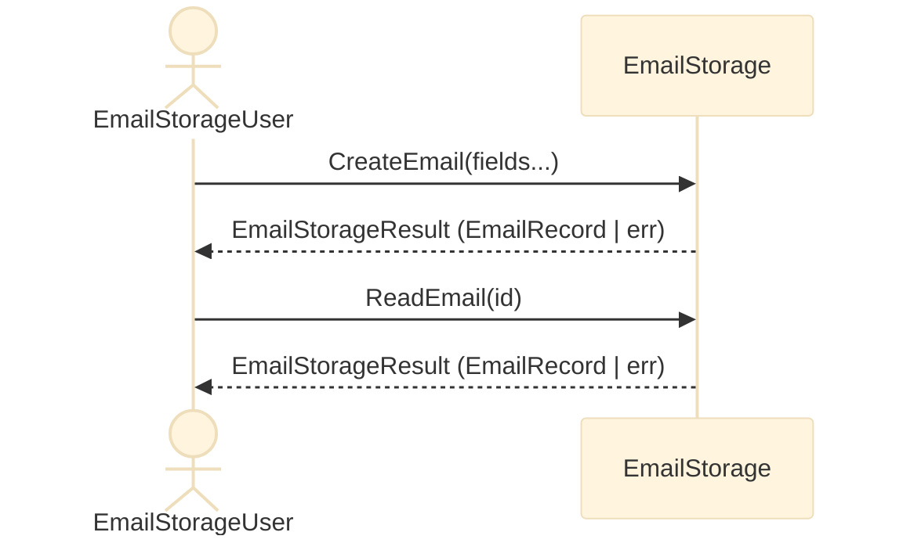

# Design to go with [dbj_discriminated_union.c](dbj_discriminated_union.c)


> **Caveat Emptor**: We are enjoying the metapresence of [DBJ Taxonomys](https://method.dbj.org/taxonomy_core.html). Thus we know where are we in the information space with these endeavor. Top category: **Implementation**. Capability: **Development**. In other word: We know what is this all about. And we can explain it to the reader.


## Top-level logical design

### Top level requirement: [RQ01](top_level_requirements.md#rq01-email-crud-application)

#### **EmailRecord**

- `EmailRecord` is the central, tagged type. 
  - Storage is an logical array of `EmailRecord`s
    - We consider this a specialized storage for `EmailRecords`s
    - `EmailRecord` ID is index on that array
      - we keep this ID also in the record itself for quick retrieval

**Synopsys**

```c
typedef U8TYPE EmailId;

#define EMAIL_ID_EMPTY \
    ((EmailId)0x00) /* reserved — marks empty slot NOT null record */

typedef struct {
    EmailId id;
    char to[64];
    char from[64];
    char subject[128];
    char body[512];
} EmailRecord;

static const EmailRecord EMPTY_EMAIL_RECORD = {.id = EMAIL_ID_EMPTY};

```

#### **EmailStorage**

    - Logically has associated CRUD verbs
      - That is the language it speaks
    - CRUD Verbs are logically executed inside a `EmailStorage` and accessible over its API (Interface)
      - CRUD verbs are dispatch, not data: each verb is a plain function
        - Data is passed in and out as function parameters nad return values
    - CRUD verbs are
      - CreateEmail
      - ReadEmail
      - UpdateEmail
      - DeleteEmail
    - Thus those are the core methods of the `EmailStorage` interface
    - **EmailStorageUser** knows the language of the `EmailStorage`

Standard return type is: `EmailStorageResult`. It is a tagged union, returning the `EmailRecord` or an error
```
EmailStorageResult.err
    char[512] : error location (file, function, line_number)
    char[512] : error message
```

**Synopsis**

```c
typedef enum : U8TYPE {
    EMAIL_STORAGE_OK,
    EMAIL_STORAGE_ERR,
} EmailStorageResultTag;

typedef struct EmailStorageResult EmailStorageResult;

struct EmailStorageResult {
    EmailStorageResultTag tag;
    union {
        struct {
            EmailStorageResult (*make)(EmailRecord record);
            EmailRecord record;
        } ok;
        struct {
            EmailStorageResult (*make)(const char* location, const char* message);
            char location[512]; /* file:function:line, e.g. via __FILE__ ":" __func__ ":" ... */
            char message[512];
        } err;
    };
};
```
#### User / EmailStorage interaction



#### **EmailStorage API**

**Synopsys**

```c
typedef struct EmailStorage EmailStorage;

struct EmailStorage {
    EmailRecord records[/* capacity */];

    EmailStorageResult (*CreateEmail)(EmailStorage* self, EmailRecord record);
    EmailStorageResult (*ReadEmail)(EmailStorage* self, EmailId id);
    EmailStorageResult (*UpdateEmail)(EmailStorage* self, EmailRecord record);
    EmailStorageResult (*DeleteEmail)(EmailStorage* self, EmailId id);
};
```

`CreateEmail`/`ReadEmail`/`UpdateEmail`/`DeleteEmail` are function
pointers carried on the `EmailStorage` instance itself — same "make"
pattern already used by `Result` and `EmailStorageResult` — so the CRUD
API travels with the storage rather than being a set of free functions
the user has to know by name.