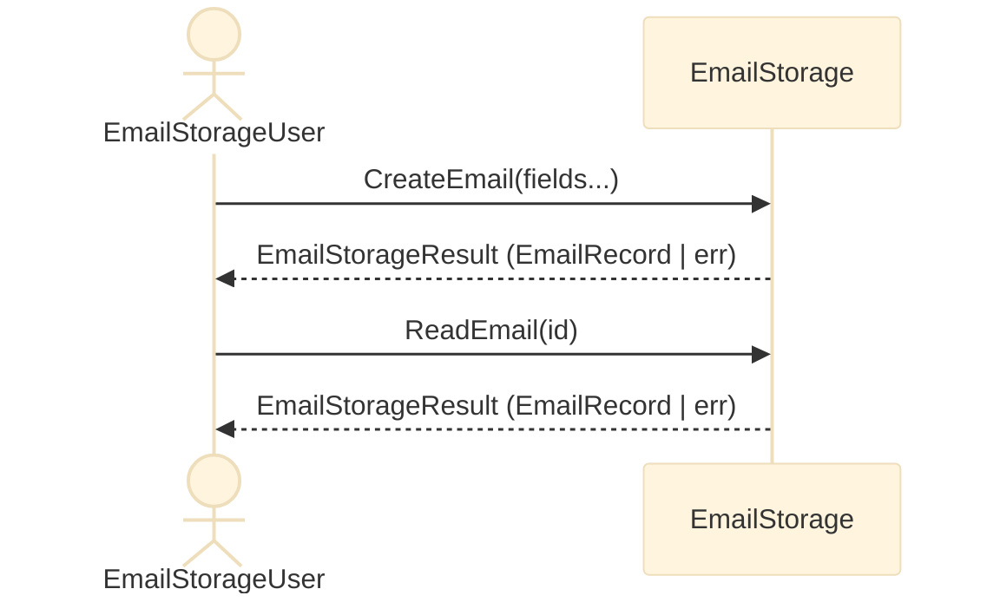
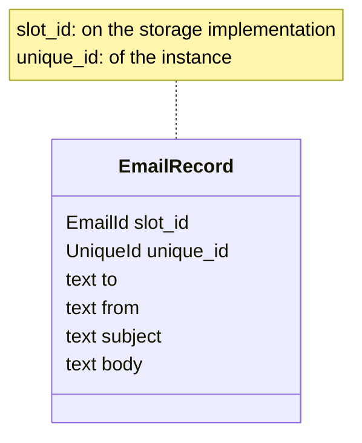
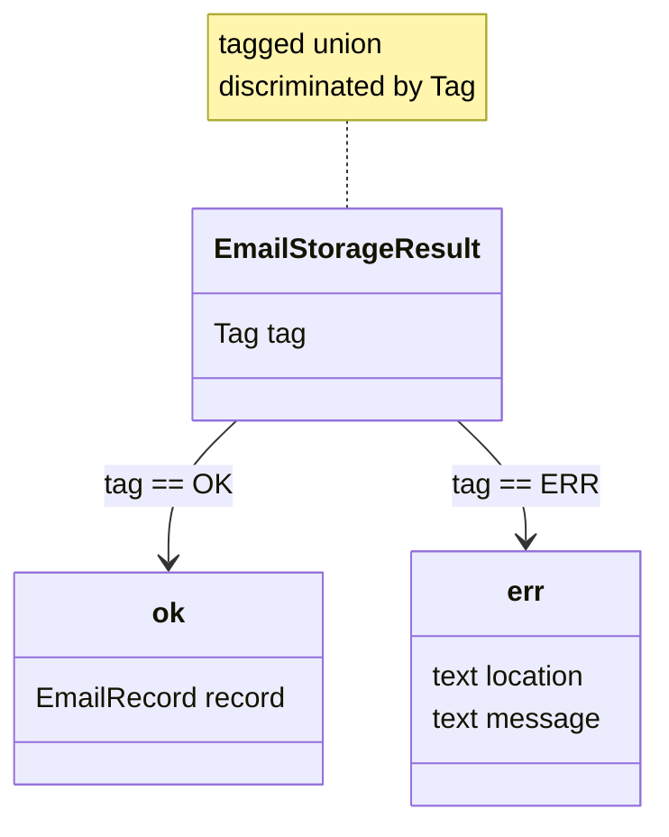
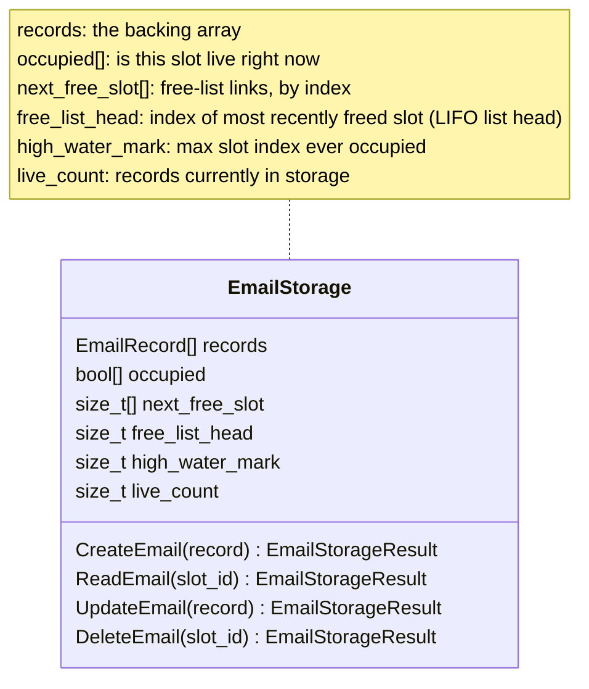
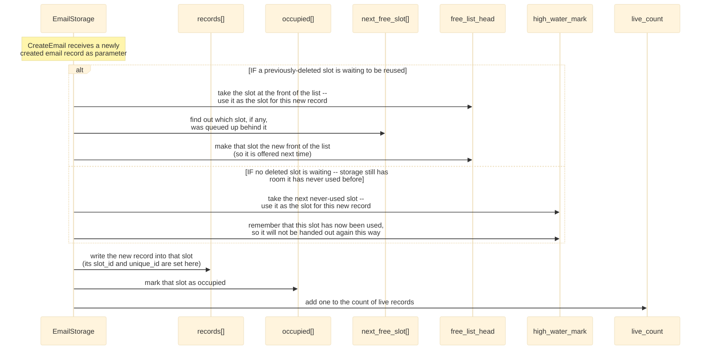
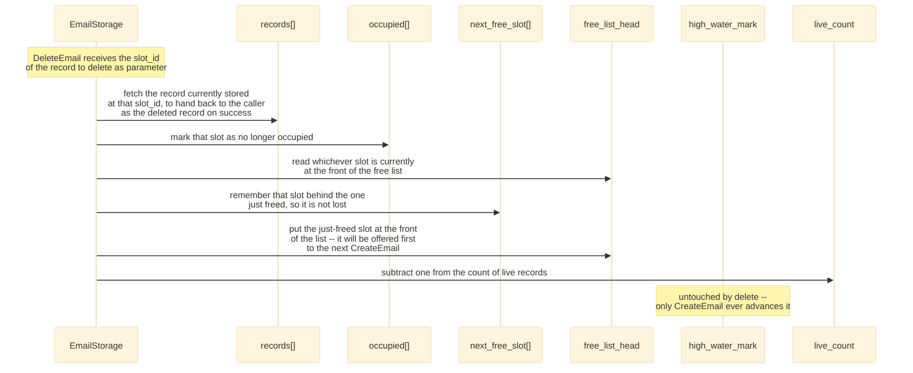

<h1> General Design Notes </h1>

<h1 style="font-size:10rem; font-weight:normal; font-family:georgia"> W.I.P. </h1>


> First time visitor can understand easily what is this all about. And we can explain it better. 
> 
> We are enjoying the metapresence of [DBJ Taxonomies](https://method.dbj.org/taxonomy_core.html). Thus we can communicate where are we in the information space with this doc. 
>

```
Category:       Implementation
Capability:     Development
```

**Table of Contents**
- [Top-level logical design](#top-level-logical-design)
  - [Top level requirement: RQ01](#top-level-requirement-rq01)
  - [User / EmailStorage interaction](#user--emailstorage-interaction)
  - [**EmailRecord**](#emailrecord)
  - [EmailStorageResult](#emailstorageresult)
  - [EmailStorage](#emailstorage)
    - [Free Slots concept](#free-slots-concept)
  - [Note on Multi Threading](#note-on-multi-threading)


# Top-level logical design

## Top level requirement: [RQ01](top_level_requirements.md#rq01-email-crud-application)

## User / EmailStorage interaction


**Notice on user required and assumed behavior**

In order to use this API (Interface) User has to first obtain the instance to the storage. Plus to that solution, is that user can potentially use multiple storages. Minus is that obtaining the storage or storages instances is yet undefined on the system level. For example. System architecture might conclude a single email storage is preferred but has to be externally controlled. Or the opposite. Many/several encapsulated storages. In any case that is out of the scope of this design.

## **EmailRecord**

`EmailRecord` is the central, tagged type. Storage is a logical array
of `EmailRecord`s, plus a singly-linked free list threaded through the
same array for slot reuse — a specialized storage for `EmailRecord`s,
not a general one.

There is no table here, so no `ROWID` in the SQLite sense — but the
same distinction is worth naming, since it is exactly what trips
people up: every record carries **two** ids, with two different
lifetimes.

- `slot_id` — a plain array index, what CRUD keys every lookup on. Not
  a permanent identity: a deleted slot's index is reissued to the next
  `CreateEmail`, so the same numeric `slot_id` can belong to a
  different record over time.
- `unique_id` — assigned once on create, never reused, never looked up
  by. It exists purely so a record's identity stays legible even after
  its `slot_id` has been reissued. Its own type, `UniqueId`, is kept
  distinct from `slot_id`'s `EmailId` — the two ids answer different
  questions (which slot vs. which record), so sharing one type made
  that easy to miss.


**Synopsis**




## EmailStorageResult

Standard return type is: `EmailStorageResult`. It is a tagged union, returning the `EmailRecord` or an error

**Synopsis**



**Future improvements**. Notice we say "improvements" not "extensions".

- user configurable size of `location` and `message` char arrays, on the `err` struct.
  - that also allows for using char array parameters with size hint
- both `location` and `message` in a json format
  - Discuss: why not just one json formatted `payload`?

## EmailStorage

The core methods of the `EmailStorage` interface.

**Synopsis**



### Free Slots concept

Storage is a fixed-capacity array of `EmailRecord`s (see the `slot_id`
discussion under EmailRecord above for why a deleted slot's index is
reused rather than retired).

**Operation: Create**



**Operation: Delete**




## Note on Multi Threading

Currently the design and code do not work in presence of multiple threads. That will be relatively straightforward to solve. We will use a single light mutex to be reachable from MailStorage public API and lock on entry unlock on leaving pattern. For that to be simple and resilient we will use the mandated compiler (GCC 15+) `defer` statement.
